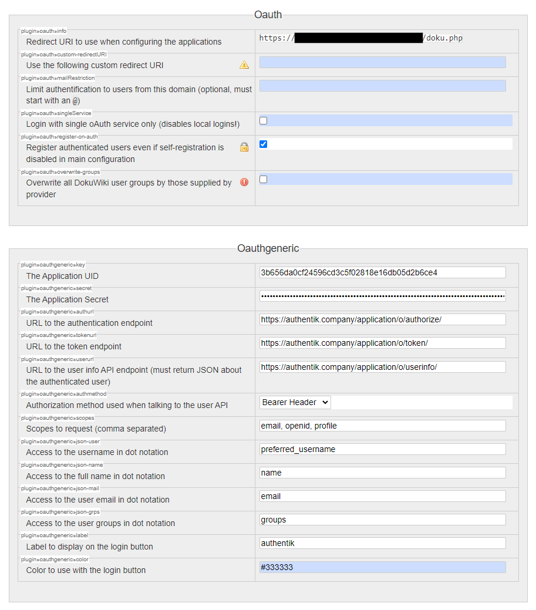

Support level: Community

## What is Service Name

From https://en.wikipedia.org/wiki/DokuWiki

:::note
DokuWiki is a wiki application licensed under GPLv2 and written in the PHP programming language. It works on plain text files and thus does not need a database. Its syntax is similar to the one used by MediaWiki. It is often recommended as a more lightweight, easier to customize alternative to MediaWiki.
:::

## Preparation

The following placeholders will be used:

-   `dokuwiki.company` is the FQDN of the DokiWiki install.
-   `authentik.company` is the FQDN of the authentik install.

## Service Configuration

In DokuWiki, navigate to the _Extension Manager_ section in the _Administration_ interface and install

-   https://www.dokuwiki.org/plugin:oauth
-   https://www.dokuwiki.org/plugin:oauthgeneric

Navigate to _Configuration Settings_ section in the _Administration_ interface and change _Oauth_ and _Oauthgeneric_ options:

For _Oauth_:

-   Check the _plugin»oauth»register-on-auth_ option

For _Oauthgeneric_:

-   plugin»oauthgeneric»key: The Application UID
-   plugin»oauthgeneric»secret: The Application Secret
-   plugin»oauthgeneric»authurl: https://authentik.company/application/o/authorize/
-   plugin»oauthgeneric»tokenurl: https://authentik.company/application/o/token/
-   plugin»oauthgeneric»userurl: https://authentik.company/application/o/userinfo/
-   plugin»oauthgeneric»authmethod: Bearer Header
-   plugin»oauthgeneric»scopes: email, openid, profile
-   plugin»oauthgeneric»needs-state: checked
-   plugin»oauthgeneric»json-user: preferred_username
-   plugin»oauthgeneric»json-name: name
-   plugin»oauthgeneric»json-mail: email
-   plugin»oauthgeneric»json-grps: groups

In the _Configuration Settings_ section in the _Administration_ interface navigate to _Authentication_ and activate _oauth_ in _Authentication backend_.

## authentik Configuration

### Provider

In authentik, under _Providers_, create an _OAuth2/OpenID Provider_ with these settings:

-   Redirect URI: The _Callback URL / Redirect URI_ from _plugin»oauth»info_, usually `dokuwiki.company/doku.php`
-   Signing Key: Select any available key

Note the _client ID_ and _client secret_, then save the provider. If you need to retrieve these values, you can do so by editing the provider.

### Application

In authentik, create an application which uses this provider. Optionally apply access restrictions to the application using policy bindings.
Set the Launch URL to the _Callback URL / Redirect URI_ (`dokuwiki.company/doku.php`).
