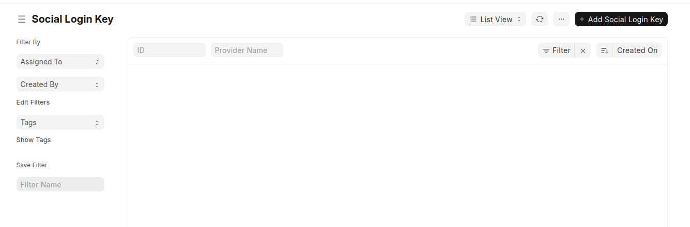
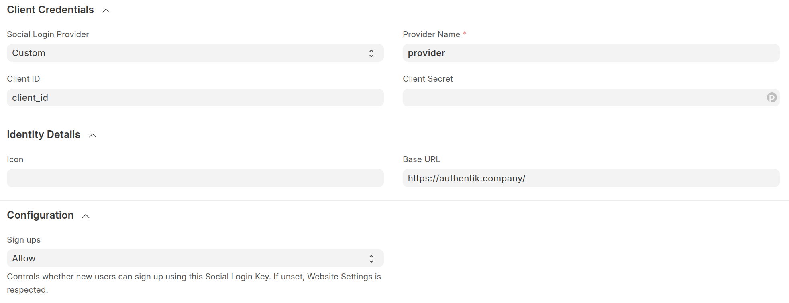
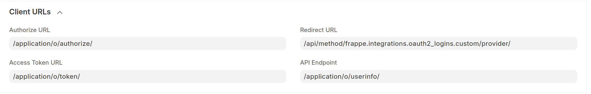
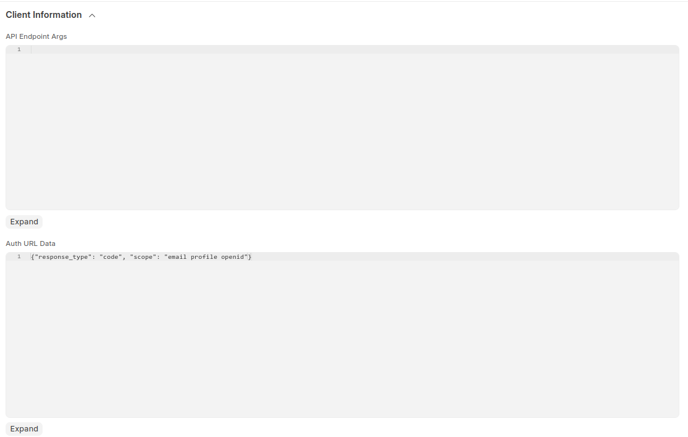

:::note
These instructions apply to all projects in the Frappe Family.
:::

## What is Frappe

> Frappe is a full stack, batteries-included, web framework written in Python and JavaScript.
>
> -- https://frappe.io/

## Preparation

The following placeholders are used in this guide:

- `frappe.company` is the FQDN of the Frappe installation.
- `authentik.company` is the FQDN of the authentik installation.
- `provider` is the name for the social login provider in Frappe.

:::note
This documentation lists only the settings that you need to change from their default values. Be aware that any changes other than those explicitly mentioned in this guide could cause issues accessing your application.
:::

## authentik configuration

To support the integration of Frappe with authentik, you need to create an application/provider pair in authentik.

### Create an application and provider in authentik

1. Log in to authentik as an admin, and open the authentik Admin interface.
2. Navigate to **Applications** > **Applications** and click **Create with Provider** to create an application and provider pair. (Alternatively you can first create a provider separately, then create the application and connect it with the provider.)

- **Application**: provide a descriptive name, an optional group for the type of application, the policy engine mode, and optional UI settings.
- **Choose a Provider type**: select **OAuth2/OpenID Connect** as the provider type.
- **Configure the Provider**: provide a name (or accept the auto-provided name), the authorization flow to use for this provider, and the following required configurations.
    - Note the **Client ID**, **Client Secret**, and **slug** values because they will be required later.
    - Set a `Strict` redirect URI to <kbd>https://<em>frappe.company</em>/api/method/frappe.integrations.oauth2_logins.custom/provider</kbd>.
    - Select any available signing key.
    - Under **Advanced Protocol Settings**, set **Subject mode** to be `Based on the Users's username`.
- **Configure Bindings** _(optional)_: you can create a [binding](/docs/add-secure-apps/flows-stages/bindings/) (policy, group, or user) to manage the listing and access to applications on a user's **My applications** page.

3. Click **Submit** to save the new application and provider.

## Frappe configuration

1. From the Frappe main menu, navigate to **Integrations**, then to **Social Login Key**.

Add a new Social login Key using the black button on top right.

2.  Enter the following settings:

        - In the **Client Credentials** section:
            - Enable Social Login: Turn the checkmark to the _on_ position.
            - Client ID: _client-id-from-authentik_
            - Client Secret: _client-secret-from-authentik_

        - In the **Configuration** section:
            - Sign ups: Allow

    

        - In the **Identity Details** section:
            - Base URL: `https://authentik.company/`
            - In Client URLs section:
            - Authorize URL: `/application/o/authorize/`
            - Access Token URL: `/application/o/token/`
            - Redirect URL: `https://frappe.company/api/method/frappe.integrations.oauth2_logins.custom/provider/`
            - API Endpoint: `/application/o/userinfo/`

    

        - In the **Client Information** section:
            - Auth URL Data: `{"response_type": "code", "scope": "email profile openid"}`

    

3.  Press the black **Save** button on the top right.

## Verification

1. Go to `https://frappe.company` from Incognito mode.
2. Click **Login with provider** on the login screen.
3. Authorize with authentik.
4. You will be redirected to home screen of Frappe application.
