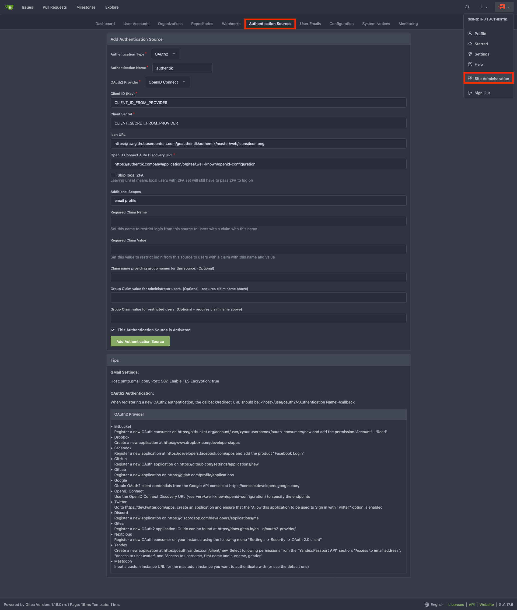

<span class="badge badge--secondary">Support level: Community</span>

## What is Gitea

> Gitea is a community managed lightweight code hosting solution written in Go. It is published under the MIT license.
>
> -- https://gitea.io/

:::note
This is based on authentik 2022.10.1 and Gitea 1.17.3 installed using the official docker image [https://docs.gitea.io/en-us/install-with-docker/](https://docs.gitea.io/en-us/install-with-docker/). Instructions may differ between versions.
:::

## Preparation

The following placeholders will be used:

-   `authentik.company` is the FQDN of authentik.
-   `gitea.company` is the FQDN of Gitea.

### Step 1

In authentik, create an _OAuth2/OpenID Provider_ (under _Applications/Providers_) with these settings:

:::note
Only settings that have been modified from default have been listed.
:::

**Protocol Settings**

-   Name: Gitea
-   Signing Key: Select any available key

:::note
Take note of the `Client ID` and `Client Secret`, you'll need to give them to Gitea in _Step 3_.
:::

### Step 2

In authentik, create an application (under _Applications/Applications_) which uses this provider. Optionally apply access restrictions to the application using policy bindings.

:::note
Only settings that have been modified from default have been listed.
:::

-   Name: Gitea
-   Slug: gitea-slug
-   Provider: Gitea

### Step 3

Navigate to the _Authentication Sources_ page at https://gitea.company/admin/auths and click `Add Authentication Source`

Change the following fields

-   Authentication Name: authentik
-   OAuth2 Provider: OpenID Connect
-   Client ID (Key): Step 1
-   Client Secret: Step 1
-   Icon URL: https://authentik.company/static/dist/assets/icons/icon.svg
-   OpenID Connect Auto Discovery URL: https://authentik.company/application/o/gitea-slug/.well-known/openid-configuration
-   Additional Scopes: `email profile`



`Add Authentication Source` and you should be done. Your Gitea login page should now have a `Sign in With` followed by the authentik logo which you can click on to sign-in to Gitea with Authentik creds.

### Step 4 _(optional Claims for authorization management)_

:::note
This step is **optional** and shows how to set claims to control the permissions of users in gitea by adding them to groups.
:::

#### Define Groups

The following groups will be used:

-   `gituser` for normal Gitea users.
-   `gitadmin` for Gitea users with administrative permissions.
-   `gitrestricted` for restricted Gitea users.

:::note
Users who are in none of these groups will not be able to log in to gitea.
:::

In authentik, create three groups (under _Directory/Groups_) with the _Name_ as mentioned above and leave other settings untouched.

:::note
You can add Members to the groups now or anytime later.
:::

#### Create Custom Property Mapping

In authentik, create a custom property mapping (under _Customization/Property Mappings_) which has the type **Scope Mapping**.

:::note
Only settings that have been modified from default have been listed.
:::

-   Name: authentik gitea OAuth Mapping: OpenID 'gitea'
-   Scope name: gitea

And as **Expression** set the following:

```(python)
gitea_claims = {}
if request.user.ak_groups.filter(name="gituser").exists():
    gitea_claims["gitea"]= "user"
if request.user.ak_groups.filter(name="gitadmin").exists():
    gitea_claims["gitea"]= "admin"
if request.user.ak_groups.filter(name="gitrestricted").exists():
    gitea_claims["gitea"]= "restricted"

return gitea_claims
```

#### Add the custom Property Mapping to the Gitea Provider

In authentik, edit the **Gitea** provider (under _Applications/Providers_) by clicking the pencil Icon.

Unfold the _Advanced protocol settings_ and activate these Mappings:

-   authentik default OAuth Mapping: OpenID 'email'
-   authentik default OAuth Mapping: OpenID 'profile'
-   authentik default OAuth Mapping: OpenID 'openid'
-   authentik gitea OAuth Mapping: OpenID 'gitea'

Click `Update` and the configuration authentik is done.

#### Configure Gitea to use the new claims

Navigate to the _Authentication Sources_ page at https://gitea.company/admin/auths and edit the **authentik** Authentication Source.

Change the following fields

-   Additional Scopes: `email profile gitea`
-   Required Claim Name: `gitea`
-   Claim name providing group names for this source. (Optional): `gitea`
-   Group Claim value for administrator users. (Optional - requires claim name above): `admin`
-   Group Claim value for restricted users. (Optional - requires claim name above): `restricted`

`Update Authentication Source` and you should be done.

Users without any of the defined groups should no longer be able to log in.
Users of the group **gitadmin** should have administrative privileges, and users in the group **gitrestricted** should be restricted.

## Helm Chart Configuration

authentik can be configured automatically in Gitea Kubernetes deployments via it's [Helm Chart](https://gitea.com/gitea/helm-chart/).

:::note
This is based on authentik 2022.8.2, Gitea v17.2, and Gitea Helm Chart v6.0.1. Instructions may differ between versions.
:::

Add the following to the Gitea Helm Chart `values.yaml` file:

```yaml
gitea:
    oauth:
        - name: "authentik"
          provider: "openidConnect"
          key: "CLIENT_ID_FROM_AUTHENTIK" #Step 1
          secret: "CLIENT_SECRET_FROM_AUTHENTIK" #Step 1
          autoDiscoveryUrl: "https://authentik.company/application/o/gitea-slug/.well-known/openid-configuration"
          iconUrl: "https://goauthentik.io/img/icon.png"
          scopes: "email profile"
```

### Kubernetes Secret

Alternatively you can use a Kubernetes secret to set the `key` and `secret` values.

Create a Kubernetes secret with the following:

```yaml
apiVersion: v1
kind: Secret
metadata:
    name: gitea-authentik-secret
type: Opaque
stringData:
    key: "CLIENT_ID_FROM_AUTHENTIK" #Step 1
    secret: "CLIENT_SECRET_FROM_AUTHENTIK" #Step 1
```

Add the following to the Gitea Helm Chart `values.yaml` file:

```yaml
gitea:
    oauth:
        - name: "authentik"
          provider: "openidConnect"
          existingSecret: gitea-authentik-secret
          autoDiscoveryUrl: "https://authentik.company/application/o/gitea-slug/.well-known/openid-configuration"
          iconUrl: "https://goauthentik.io/img/icon.png"
          scopes: "email profile"
```
