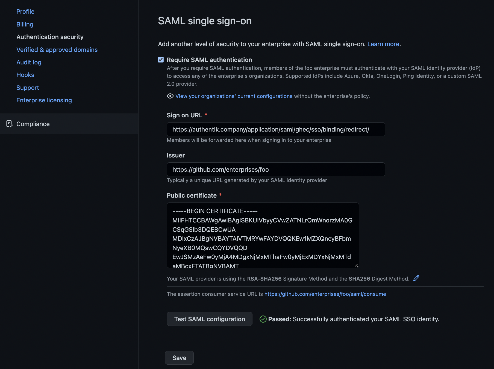

## What is GitHub Enterprise Cloud

> GitHub is a complete developer platform to build, scale, and deliver secure software. Businesses use our suite of products to support the entire software development lifecycle, increasing development velocity and improving code quality.
>
> -- https://docs.github.com/en/enterprise-cloud@latest/admin/overview/about-github-for-enterprises

:::note
GitHub Enterprise Cloud EMU (Enterprise Managed Users) are not compatible with authentik. GitHub currently only permits SAML/OIDC for EMU organizations with Okta and/or Microsoft Entra ID (Azure AD).
:::

## Preparation

The following placeholders are used in this guide:

- `github.com/enterprises/foo` is your GitHub organization, where `foo` is the name of your enterprise
- `authentik.company` is the FQDN of the authentik installation.

:::note
This documentation lists only the settings that you need to change from their default values. Be aware that any changes other than those explicitly mentioned in this guide could cause issues accessing your application.
:::

## authentik configuration

To support the integration of GitHub Enterprise Cloud with authentik, you need to create an application/provider pair in authentik.

### Create an application and provider in authentik

1. Log in to authentik as an admin, and open the authentik Admin interface.
2. Navigate to **Applications** > **Applications** and click **Create with Provider** to create an application and provider pair. (Alternatively you can create only an application, without a provider, by clicking **Create.)**

- **Application**: provide a descriptive name, an optional group for the type of application, the policy engine mode, and optional UI settings.
- **Choose a Provider type**: select **SAML Provider** as the provider type.
- **Configure the Provider**: provide a name (or accept the auto-provided name), the authorization flow to use for this provider, and the following required configurations.
    - Set the **ACS URL** to <kbd>https://github.com/enterprises/foo/saml/consume</kbd>.
    - Set the **Audience** to <kbd>https://github.com/enterprises/foo</kbd>
    - Set the **Issuer** to <kbd>https://github.com/enterprises/foo</kbd>.
    - Set the **Service Provider Binding** to `Post`.
    - Under **Advanced protocol settings**, select an available signing certificate. It is advised to download this certificate as it will be required later. It can be found under **System** > **Certificates** in the Admin Interface.
- **Configure Bindings** _(optional)_: you can create a [binding](/docs/add-secure-apps/flows-stages/bindings/) (policy, group, or user) to manage the listing and access to applications on a user's **My applications** page.

3. Click **Submit** to save the new application and provider.

## GitHub Configuration

Navigate to your enterprise settings by clicking your GitHub user portrait in the top right of GitHub.com, select `Your enterprises` and click `Settings` for the enterprise you wish to configure.

In the left-hand navigation, within the `Settings` section, click `Authentication security`

On this page:

- Select the `Require SAML authentication` checkbox.
- In `Sign on URL`, type `https://authentik.company/application/saml/<authentik application slug>/sso/binding/redirect/`
- For `Issuer`, type `https://github.com/enterprises/foo` or the `Audience` you set in authentik
- For `Public certificate`, paste the _full_ signing certificate into this field.
- Verify that the `Signature method` and `Digest method` match your SAML provider settings in authentik.

Once these fields are populated, you can use the `Test SAML configuration` button to test the authentication flow. If the flow completes successfully, you will see a green tick next to the Test button.

Scroll down to hit the `Save` button below.
