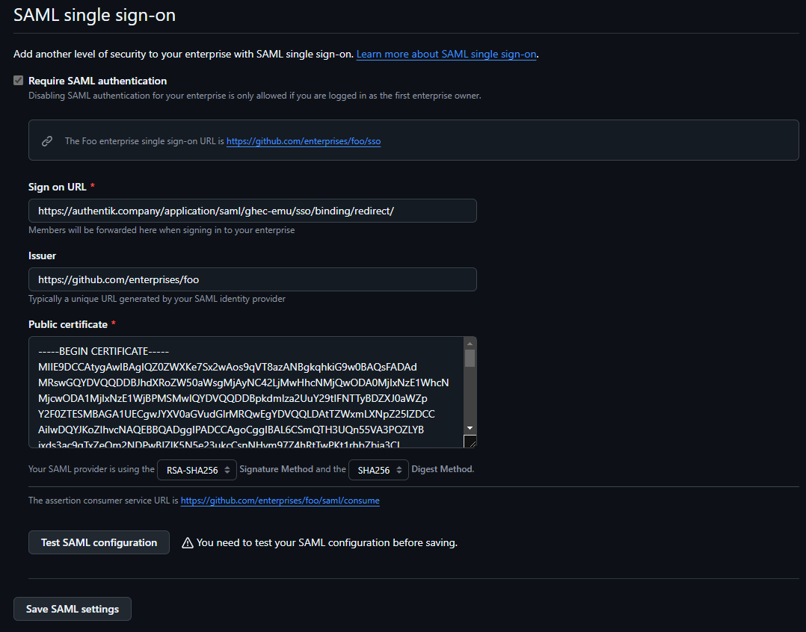

## What is GitHub Enterprise Cloud - Enterprise Managed Users

> With Enterprise Managed Users, you manage the lifecycle and authentication of your users on GitHub from an external identity management system, or IdP:
>
> - Your IdP provisions new user accounts on GitHub, with access to your enterprise.
> - Users must authenticate on your IdP to access your enterprise's resources on GitHub.
> - You control usernames, profile data, organization membership, and repository access from your IdP.
> - If your enterprise uses OIDC SSO, GitHub will validate access to your enterprise and its resources using your IdP's Conditional Access Policy (CAP). See "About support for your IdP's Conditional Access Policy."
> - Managed user accounts cannot create public content or collaborate outside your enterprise. See "Abilities and restrictions of managed user accounts."
>
> -- https://docs.github.com/en/enterprise-cloud@latest/admin/managing-iam/understanding-iam-for-enterprises/about-enterprise-managed-users

## Preparation

The following placeholders are used in this guide:

- `github.com/enterprises/foo` is your GitHub organization, where `foo` is the name of your enterprise
- `authentik.company` is the FQDN of the authentik installation.
- `GitHub Users` is an authentik group used for holding GitHub users.
- `GitHub Admins` is an authentik group used for indicating GitHub administrators.

:::note
This documentation lists only the settings that you need to change from their default values. Be aware that any changes other than those explicitly mentioned in this guide could cause issues accessing your application.
:::

## authentik configuration

To support the integration of GitHub Enterprise Cloud EMU with authentik, you need to create an application/provider pair in authentik.

:::note
In order to use GitHub Enterprise Cloud EMU, SCIM must also be set up.
:::

:::note
GitHub will create usenames for your EMU users based on the SAML `NameID` proprety which must also match SCIM's `_userName_` attribute.
:::note

### Create an application and provider in authentik

1. Log in to authentik as an admin, and open the authentik Admin interface.
2. Navigate to **Applications** > **Applications** and click **Create with Provider** to create an application and provider pair. (Alternatively you can create only an application, without a provider, by clicking **Create**.)

- **Application**: provide a descriptive name, an optional group for the type of application, the policy engine mode, and optional UI settings.
- **Choose a Provider type**: select **SAML Provider** as the provider type.
- **Configure the Provider**: provide a name (or accept the auto-provided name), the authorization flow to use for this provider, and the following required configurations.
    - Set the **ACS URL** to <kbd>https://github.com/enterprises/foo/saml/consume</kbd>.
    - Set the **Audience** to <kbd>https://github.com/enterprises/foo</kbd>
    - Set the **Issuer** to <kbd>https://github.com/enterprises/foo</kbd>.
    - Set the **Service Provider Binding** to `Post`.
    - Under **Advanced protocol settings**, select an available signing certificate. It is advised to download this certificate as it will be required later. It can be found under **System** > **Certificates** in the Admin Interface.
    - Under **NameID Property Mapping**, set **NameID Property Mapping** to be based on the `Email` field.
- **Configure Bindings** _(optional)_: you can create a [binding](/docs/add-secure-apps/flows-stages/bindings/) (policy, group, or user) to manage the listing and access to applications on a user's **My applications** page.

3. Click **Submit** to save the new application and provider.

**Create the users and administrator groups**

In the authentik Admin Interface, navigate to **Directory** > **Groups** and click **Create**. Set the group's name, any other desired settings, and click **Create**. Repeat this step twice: Once for the users group and once for the administrator group.

After creating the groups, select a group, navigate to the **Users** tab, and manage its members by using the **Add existing user** and **Create user** buttons as needed.

## GitHub SAML Configuration

When your EMU is provisioned by GitHub, you will receive an email inviting you reset the password of your 'setup user'. This user cannot be linked with SSO and is an emergency access account, as it will be the only account that can bypass SSO requirements.

Before enabling SAML, go to your [Personal access tokens](https://github.com/settings/tokens) on your EMU setup user and Generate a new _personal access token (classic)_. This should have a descriptive note like `SCIM Token`. It is advisable to set this to not expire. For scopes, select only _admin:enterprise_ and click _Generate token_.

Copy the resulting token to a safe location.

After you have set a password for this account and generated your SCIM token, navigate to your enterprise settings by clicking your GitHub user portrait in the top right of GitHub.com, select `Your enterprise`, click the `Settings` link, then click `Authentication security`.

On this page:

- Select the `Require SAML authentication` checkbox.
- In `Sign on URL`, input the _SSO URL (Redirect)_ entry from the SAML provider you created.
- For `Issuer`, input the `Issuer` you set in authentik
- For `Public certificate`, paste the _full_ signing certificate into this field.
- Verify that the `Signature method` and `Digest method` match your SAML provider settings in authentik.



Once these fields are populated, you can use the `Test SAML configuration` button to test the authentication flow. If the flow completes successfully, you will see a green tick next to the Test button.

Scroll down to hit the `Save SAML settings` button below.

You will now be prompted to save your SAML recovery codes, these will be necessary if you need to disable or change your SAML settings, so keep them safe!

## SCIM Provider

Before we create a SCIM provider, we also have to create a new Property Mapping. In authentik, go to _Customization_, then _Property Mappings_. Here, click _Create_, select _SCIM Provider Mapping_. Name the mapping something memorable and paste the following code in the _Expression_ field:

```python
roles = []
# Edit this if statement if you need to add more GitHub roles.
# Valid roles include:
# user, guest_collaborator, enterprise_owner, billing_manager
if ak_is_group_member(request.user, name='GitHub Admins'):
    roles.append({'value': 'enterprise_owner', 'primary': True})
else:
    roles.append({'value': 'user', 'primary': True})
return {
    "roles": roles,
}
```

If you named your group anything other than `GitHub Admins`, please ensure you change it in the code above.

Create a new SCIM provider with the following parameters:

- URL: `https://api.github.com/scim/v2/enterprises/foo/` (Replacing `foo` with your Enterprise slug.)
- Token: Paste the token provided from GitHub here.
- In the _User filtering_ section, you can select your `GitHub Users` group.
- In the _Attribute mapping_ section, de-select the `authentik default SCIM Mapping: User` mapping by selecting it on the right-hand side and clicking the left-facing single chevron.
- Select the property mapping you created in the previous step and add it by clicking the right-facing single chevron.
- You can leave the _Group Property Mappings_ as is.
- Click _Finish_.

Go back to your GitHub EMU Application created in the first step and add your new SCIM provider in the _Backchannel Providers_ field, then click the _Update_ button.

You should now be ready to assign users to your _GitHub Users_ and _GitHub Admins_ groups, which will be provisioend by the SCIM provisioner. If you do not see your users being provisioned, go to your SCIM provider and click the _Run sync again_ option. A few seconds later, you should see results of the SCIM sync.
