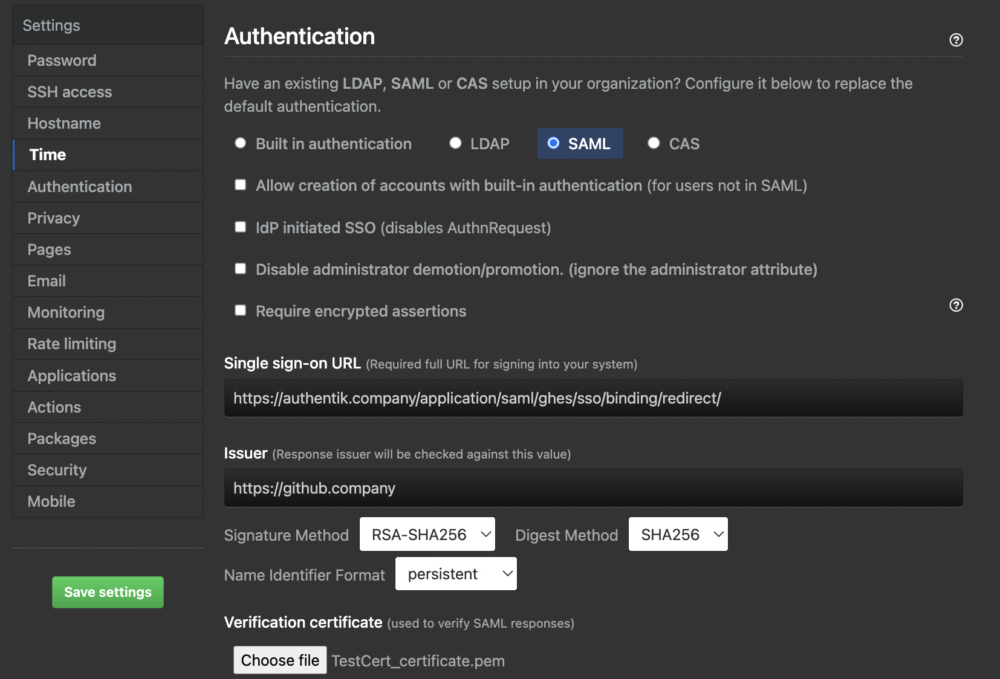

Support level: Community

## What is GitHub Enterprise Server

> GitHub Enterprise Server is a self-hosted platform for software development within your enterprise. Your team can use GitHub Enterprise Server to build and ship software using Git version control, powerful APIs, productivity and collaboration tools, and integrations. Developers familiar with GitHub.com can onboard and contribute seamlessly using familiar features and workflows.
>
> -- https://docs.github.com/en/enterprise-server@3.5/admin/overview/about-github-enterprise-server

## Preparation

The following placeholders will be used:

-   `https://github.company` is your GitHub Enterprise Server installation
-   `authentik.company` is the FQDN of the authentik Install

Create an application in authentik and note the slug, as this will be used later. Create a SAML provider with the following parameters:

-   ACS URL: `https://github.company/saml/consume`
-   Audience: `https://github.company`
-   Issuer: `https://github.company`
-   Binding: `Post`

Under _Advanced protocol settings_, set a certificate for _Signing Certificate_.

Once the provider is created, it is advised to download the signing certificate as you will need it later.

## GitHub Configuration

Navigate to your appliance maintenance settings. These are found at `https://github.company:8443`. Here, sign in with an administrator user and go to the Authentication section.

On this page:

-   Select the `SAML` option.
-   In `Sign on URL`, type `https://authentik.company/application/saml/<authentik application slug>/sso/binding/redirect/` (This is your `SSO URL (Redirect)` in Authentik)
-   For `Issuer`, type `https://github.company` or the `Audience` you set in authentik
-   Verify that the `Signature method` and `Digest method` match your SAML provider settings in authentik.
-   For `Validation certificate`, upload the signing certificate you downloaded after creating the provider.
-   Press Save settings on the left-hand side and wait for the changes to apply.

Once the appliance has saved the settings and reloaded the services, you should be able to navigate to your instance URL at `https://github.company` and sign in with SAML.
