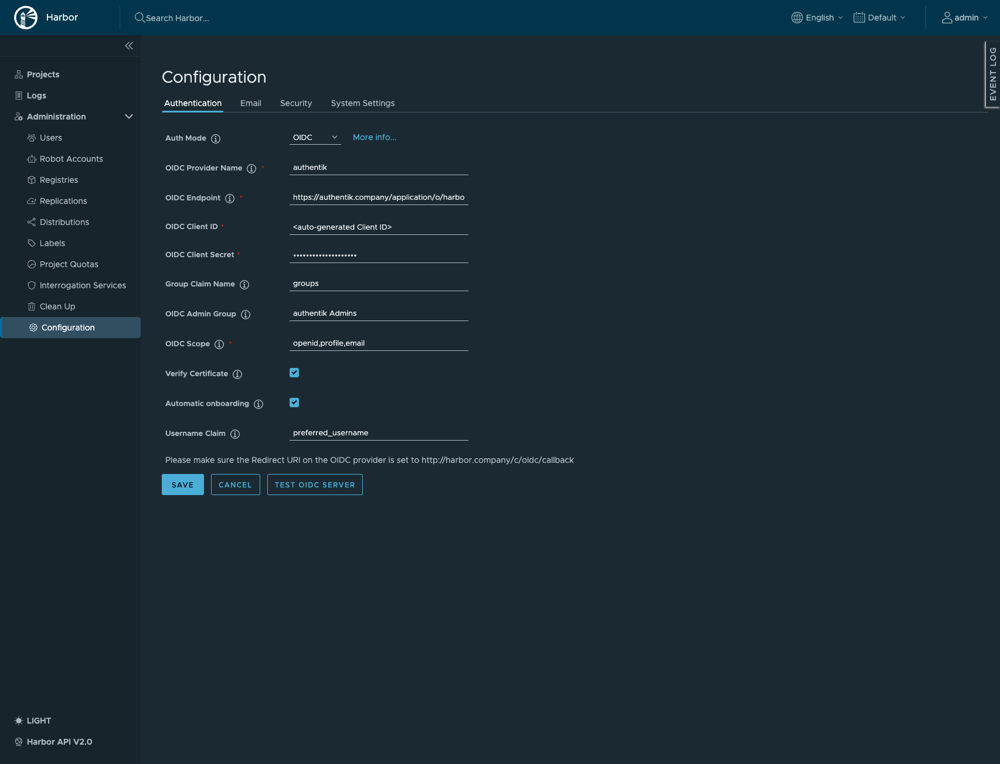

Support level: Community

## What is Harbor

> Harbor is an open-source container registry platform used for storing, securing, and managing container images.
>
> -- https://goharbor.io

## Preparation

The following placeholders will be used:

-   `harbor.company` is the FQDN of the Harbor install.
-   `authentik.company` is the FQDN of the authentik install.

Create an OAuth2/OpenID provider with the following parameters:

-   Client Type: `Confidential`
-   Redirect URIs: `https://harbor.company/c/oidc/callback`
-   Scopes: OpenID, Email and Profile
-   Signing Key: Select any available key

Note the Client ID and Client Secret values. Create an application, using the provider you've created above.

## Harbor
note to self: mabye describe things a little bit

