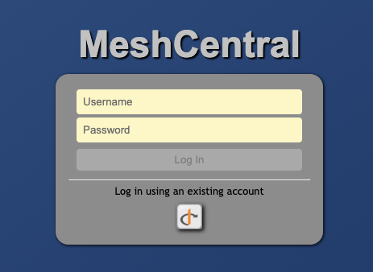

<span class="badge badge--secondary">Support level: Community</span>

## What is MeshCentral

> MeshCentral is a free, open source, web-based platform for remote device management.
>
> -- https://meshcentral.com

## Preparation

The following placeholders will be used:

- `meshcentral.company` is the FQDN of the MeshCentral install.
- `authentik.company` is the FQDN of the authentik install.

## authentik configuration

Create an OAuth2/OpenID provider with the following parameters:

- Client Type: `Confidential`
- Redirect URIs: `https://meshcentral.company/auth-oidc-callback`
- Scopes: OpenID, Email and Profile
- Signing Key: Select any available key

Note the Client ID and Client Secret values.

Next, create an application, using the provider you've created above.

## MeshCentral configuration

Edit the `config.json` for your MeshCentral deployment, and add the following code in the `domains:` subsection:

```json
    "domains": {
        (...)
            "authStrategies": {
                "oidc": {
                    "issuer": "https://authentik.company/application/o/meshcentral/",
                    "clientid": "<Client ID>",
                    "clientsecret": "<Client Secret>",
                    "newAccounts": true
                }
            },
        (...)
```

> For Docker deployments, this file should be located in the host directory you mapped to `/opt/meshcentral/meshcentral-data` in the container.

> Remember to follow JSON formatting rules.

Restart the MeshCentral server instance and browse to `https://meshcentral.company`, and you should be greeted with a new button to allow signing in with OIDC:



> Should you need to enable any advanced OIDC configurations, please see [Using the OpenID Connect Strategy on MeshCentral](https://ylianst.github.io/MeshCentral/meshcentral/openidConnectStrategy/).
