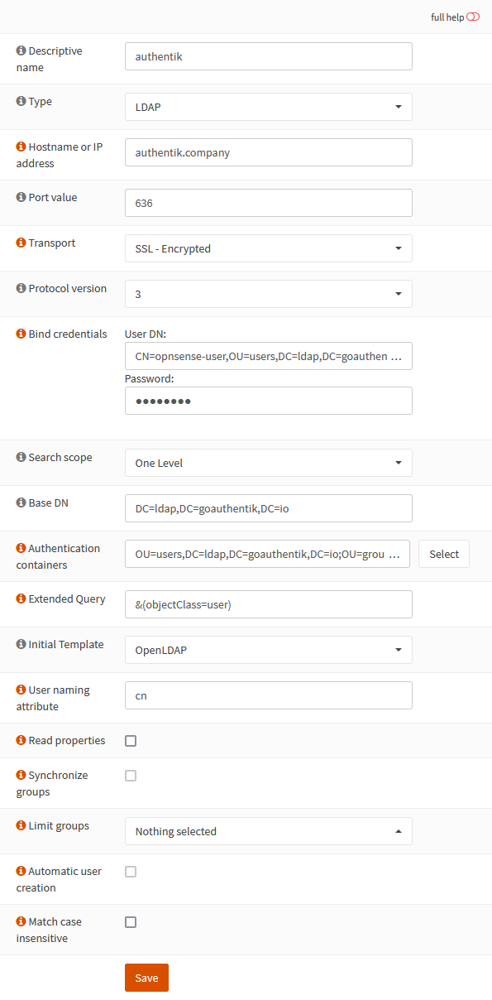

Support level: Community

## What is OPNsense

> OPNsense is a free and Open-Source FreeBSD-based firewall and routing software. It is licensed under an Open Source Initiative approved license.
>
> -- https://opnsense.org/

:::note
This is based on authentik 2022.4.1 and OPNsense 22.1.6-amd64 installed using https://docs.opnsense.org/manual/install.html. Instructions may differ between versions.
:::

## Preparation

The following placeholders will be used:

-   `authentik.company` is the FQDN of authentik.
-   `opnsense` is the name of the authentik Service account we'll create.
-   `DC=ldap,DC=goauthentik,DC=io` is the Base DN of the LDAP Provider (default)

### Step 1

In authentik, go and 'Create Service account' (under _Directory/Users_) for OPNsense to use as the LDAP Binder, leaving 'Create group' ticked as we'll need that group for the provider.
In this example, we'll use `opnsense` as the Service account's username

:::note
Take note of the password for this user as you'll need to give it to OPNsense in _Step 4_.
:::

### Step 2

In authentik, create an _LDAP Provider_ (under _Applications/Providers_) with these settings:

:::note
Only settings that have been modified from default have been listed.
:::

**Protocol Settings**

-   Name: LDAP
-   Search group: opnsense
-   Certificate: authentik Self-signed certificate

### Step 3

In authentik, create an application (under _Applications/Applications_) which uses this provider. Optionally apply access restrictions to the application using policy bindings.

:::note
Only settings that have been modified from default have been listed.
:::

-   Name: LDAP
-   Slug: ldap
-   Provider: LDAP

### Step 4

In authentik, create an outpost (under _Applications/Outposts_) of type `LDAP` that uses the LDAP Application you created in _Step 2_.

:::note
Only settings that have been modified from default have been listed.
:::

-   Name: LDAP
-   Type: LDAP

### Step 5

Add your authentik LDAP server to OPNsense by going to your OPNsense Web UI and clicking the `+` under _System/Access/Servers_.

Change the following fields

-   Descriptive name: authentik
-   Hostname or IP address: authentik.company
-   Transport: SSL - Encrypted
-   Bind credentials
    -   User DN: CN=opnsense-user,OU=users,DC=ldap,DC=goauthentik,DC=io
    -   Password: whatever-you-set
    -   Base DN: DC=ldap,DC=goauthentik,DC=io
-   Authentication containers: OU=users,DC=ldap,DC=goauthentik,DC=io;OU=groups,DC=ldap,DC=goauthentik,DC=io
-   Extended Query: &(objectClass=user)

### Step 6

In OPNsense, go to _System/Settings/Administration_ and under _Authentication_ at the bottom of that page, add `authentik` to the Server list

## Notes

:::note
Secure LDAP more by creating a group for your `DN Bind` users and restricting the `Search group` of the LDAP Provider to them.
:::
