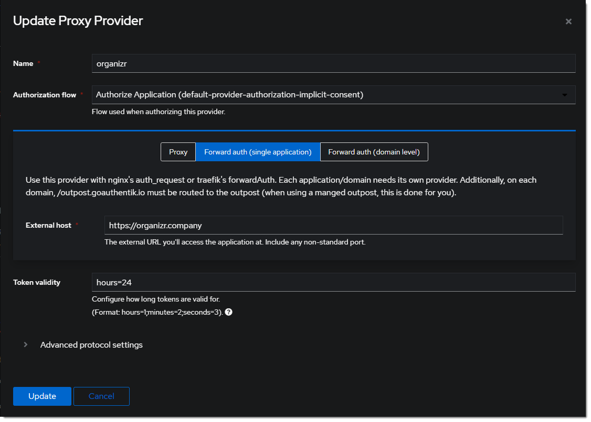
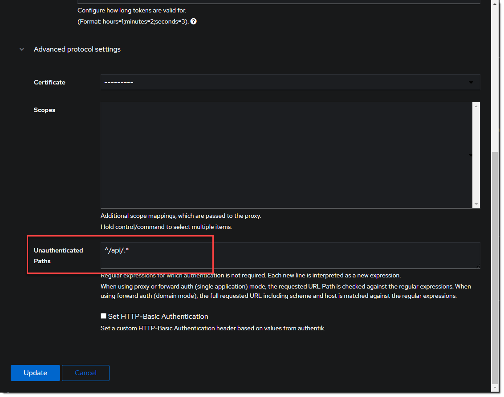
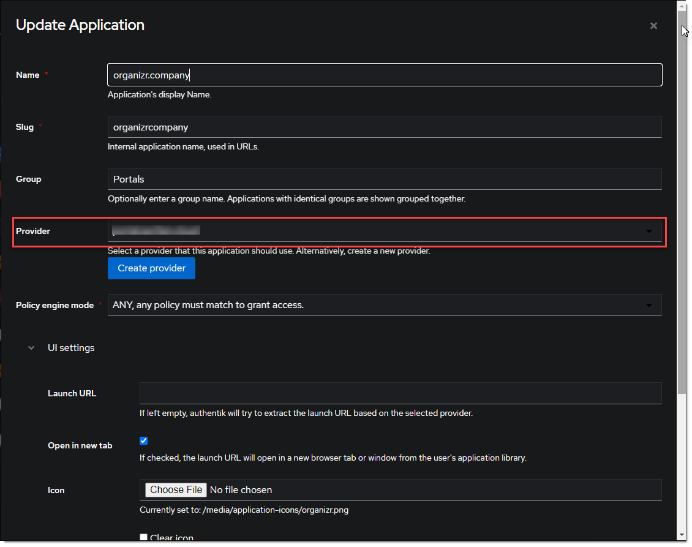
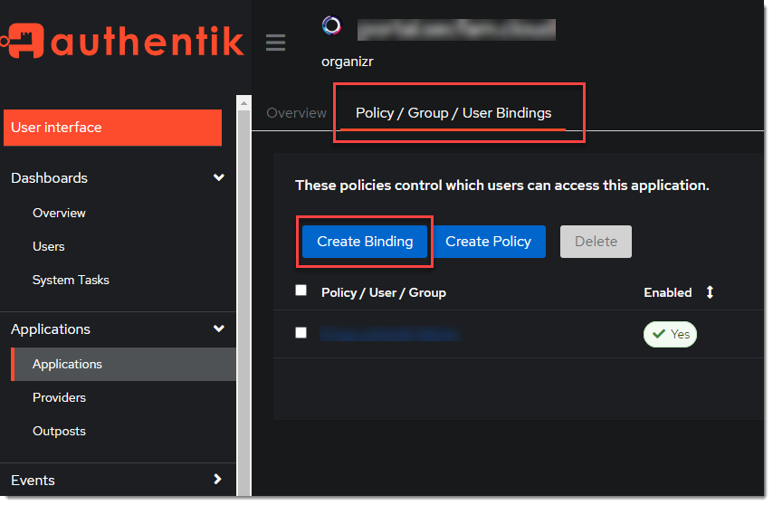
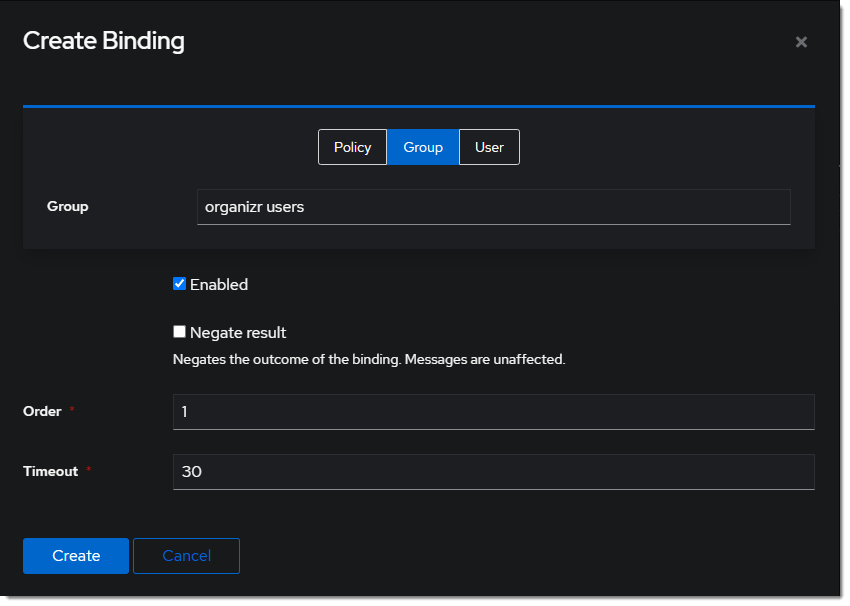
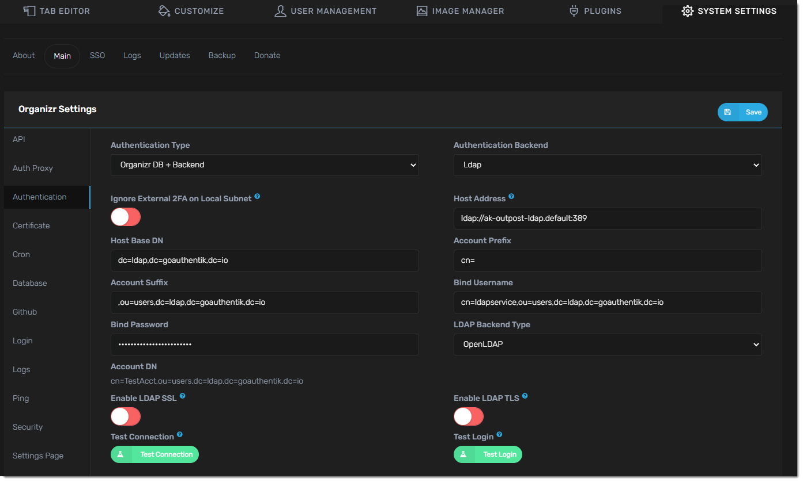

Support level: Community

## What is organizr

> Organizr allows you to setup "Tabs" that will be loaded all in one webpage.
>
> -- https://github.com/causefx/Organizr

This integration leverages authentik's LDAP for the identity provider to achieve an SSO experience. See [ldap provider generic setup](../../../docs/providers/ldap/generic_setup) for setting up the LDAP provider.

## Preparation

The following placeholders will be used:

-   `organizr.company` is the FQDN of the Service install.
-   `authentik.company` is the FQDN of the authentik install.

Create a new user account _(or reuse an existing)_ for organizr to use for LDAP bind under _Directory_ -> _Users_ -> _Create_, in this example called `ldapservice`.

     Note the DN of this user will be `cn=ldapservice,ou=users,dc=ldap,dc=goauthentik,dc=io`

:::tip
_Optionally_, create a new group like `organizr users` to scope access to the organizr application.
:::

## authentik Configuration

1. Create a new Proxy Provider for `https://organizr.company`
   
   _Optionally_, add the regular expression to allow api calls in the advanced protocol settings.
   
2. Create a new Application for the `https://organizr.company` Provider.
   
   :::tip
   _Optionally_, bind the group to control access to the organizr to the application.
   

::: 3. Add the Application to the authentik Embedded Outpost.

## organizr Configuration

:::caution
Ensure any local usernames/email addresses in organizr do not conflict with usernames/email addresses in authentik.
:::

1. Enable Auth Proxy in organizr _system settings_ -> _main_ -> _Auth Proxy_

Auth Proxy Header Name: `X-authentik-username`
Auth Proxy Whitelist: _your network subnet in CIDR notation IE_ `10.0.0.0/8`
Auth Proxy Header Name for Email: `X-authentik-email`
Logout URL: `/outpost.goauthentik.io/sign_out`

2. Setup Authentication in organizr _system settings_ -> _main_ -> _Authentication_

Authentication Type: `Organizr DB + Backend`
Authentication Backend: `Ldap`
Host Address: `<LDAP Outpost IP address:port>`
Host Base DN: `dc=ldap,dc=goauthentik,dc=io`
Account Prefix: `cn=`
Account Suffix: `,ou=users,dc=ldap,dc=goauthentik,dc=io`
Bind Username: `cn=ldapservice,ou=users,dc=ldap,dc=goauthentik,dc=io`
Bind Password: `<LDAP bind account password>`
LDAP Backend Type: `OpenLDAP`

:::info
Access for authentik users is managed locally within organizr under _User Management_. By default, new users are assigned the `User` group.
:::
:::tip
Consider front-ending your application with a [forward auth provider](../../../docs/providers/proxy/forward_auth#nginx) for an SSO experience.
:::
