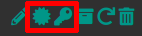

Support level: Community

## What is pfSense

> The pfSense project is a free network firewall distribution, based on the FreeBSD operating system with a custom kernel and including third party free software packages for additional functionality.
>
> -- https://www.pfsense.org/

:::note
This is based on authentik 2022.3.31 and pfSense 2.6.0-amd64
:::

## Preparation

The following placeholders will be used:

-   `authentik.company` is the FQDN of authentik.
-   `pfsense-user` is the name of the authentik Service account we'll create.
-   `DC=ldap,DC=goauthentik,DC=io` is the Base DN of the LDAP Provider (default)

### Step 1 - Service account

In authentik, create a service account (under _Directory/Users_) for pfSense to use as the LDAP Binder and take note of the password generated.

In this example, we'll use `pfsense-user` as the Service account's username

:::note
If you didn't keep the password, you can copy it from _Directory/Tokens & App password_.
:::

### Step 2 - LDAP Provider

In authentik, create a LDAP Provider (under _Applications/Providers_) with these settings :

-   Name : LDAP
-   Bind DN : `DC=ldap,DC=goauthentik,DC=io`
-   Certificate : `self-signed`

### Step 3 - Application

In authentik, create an application (under _Resources/Applications_) with these settings :

-   Name: LDAP
-   Slug: ldap
-   Provider: LDAP

### Step 4 - Outpost

In authentik, create an outpost (under _Applications/Outposts_) of type `LDAP` that uses the LDAP Application you created in _Step 3_.

-   Name: LDAP
-   Type: LDAP

## pfSense insecure setup (without SSL)

:::caution
This setup should only be used for testing purpose, because passwords will be sent in clear text to authentik.
:::

Add your authentik LDAP server to pfSense by going to your pfSense Web UI and clicking the `+ Add` under _System/User Manager/Authentication Servers_.

Change the following fields

-   Descriptive name: LDAP authentik
-   Hostname or IP address: `authentik.company`
-   Port value: 389
-   Transport: Standard TCP
-   Base DN: `DC=ldap,DC=goauthentik,DC=io`
-   Authentication containers: `OU=users,DC=ldap,DC=goauthentik,DC=io`
-   Bind anonymous: **unticked**
-   Bind credentials:
    -   User DN: `cn=pfsense-user,ou=users,dc=ldap,dc=goauthentik,dc=io`
    -   Password: `<pfsense-user password from step 2>`
-   Group member attribute: `memberOf`
-   Allow unauthenticated bind: **unticked**

## pfSense secure setup (with SSL)

When enabling SSL, authentik will send a certificate to pfSense. This certificate has to be signed by a certificate authority trusted by pfSense. In this setup we will create our own certificate authority in pfSense and create a certificate that will be used by authentik.

### Step 1 - Certificate Authority

In pfSense, create a certificate authority under _System/Cert. Manager_ and click the `+ Add` button.

-   Descriptive Name: `pfSense CA`
-   Method: Create an internal Certificate Authority
-   Common Name : `pfSense CA`

### Step 2 - Server Certificate

In pfSense, create a server certificate under _System/Cert. Manager_. Go to the _Certificates_ tab then click the `+ Add` button.

Change the following fields

-   Method: Create an internal Certificate
-   Descriptive name: `authentik.company`
-   Lifetime: `398`
-   Common Name: `authentik.company`
-   Certificate Type: `Server Certificate`

All other field can be left blank.

### Step 3 - Certificate import

In pfsense, export the public **and** the private key of the certificate by going under _System/Cert. Manager_ and then to the _Certificate_ tab.

In authentik, import the public **and** the private key by going under _System/Certificates_ and then click on `create`.

### Step 4 - Provider configuration

In authentik, edit the LDAP provider configuration under _Applications/Providers_ and select the certificate we just imported.

### Step 5 - pfSense authentication server

In pfSense, add your authentik LDAP server by going to your pfSense Web UI and clicking the `+ Add` under _System/User Manager/Authentication Servers_.

Change the following fields

-   Descriptive name: LDAP authentik
-   Hostname or IP address: `authentik.company`
-   Port value: 636
-   Transport: SSL/TLS Encrypted
-   Peer Certificate Authority: `pfSense CA`
-   Base DN: `DC=ldap,DC=goauthentik,DC=io`
-   Authentication containers: `OU=users,DC=ldap,DC=goauthentik,DC=io`
-   Bind anonymous: **unticked**
-   Bind credentials:
    -   User DN: `cn=pfsense-user,ou=users,dc=ldap,dc=goauthentik,dc=io`
    -   Password: `<pfsense-user password from step 2>`
-   Extended Query: &(objectClass=user)
-   Allow unauthenticated bind: **unticked**

## Test your setup

In pfSense, you can validate the authentication backend setup by going to _Diagnostics/Authentication_ and then select `LDAP authentik` as _Authentication Server_.

You can use the credentials of an authentik user, pfSense will tell you if the connection was successful or not. If it is, congratulations, you can now change the pfSense default authentication backend.

## Change pfSense default authentication backend

In pfSense, you can change the authentication backend used by the Web UI by going to _System/User Manager_ and then click on _Settings_ tab.

-   Authentication Server: `LDAP authentik`

## Notes

:::tip
Secure LDAP more by creating a group for your `DN Bind` users and restricting the `Search group` of the LDAP Provider to them.
:::
