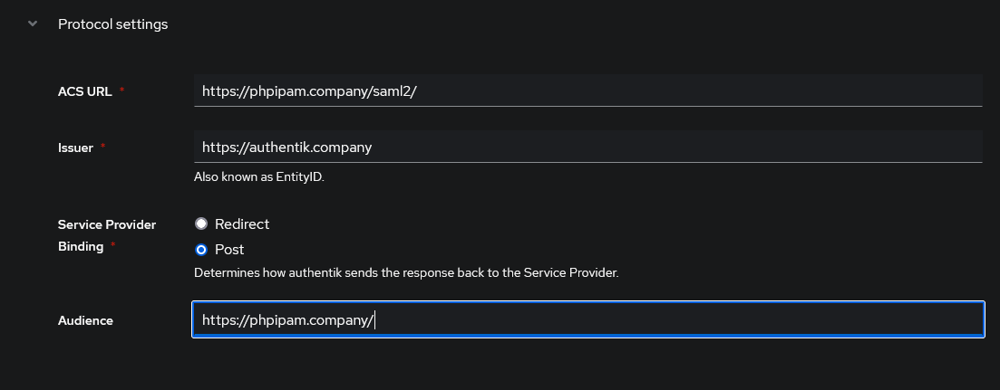
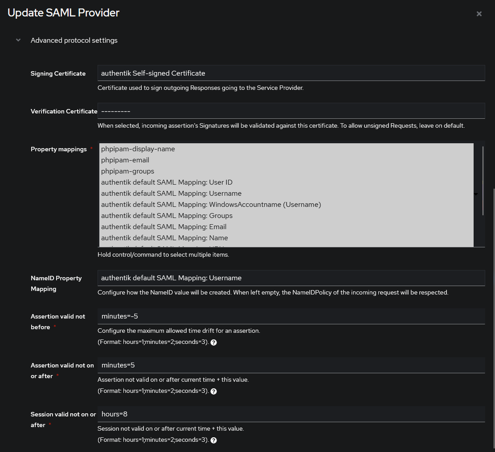
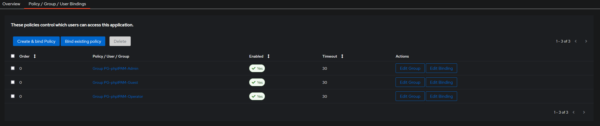
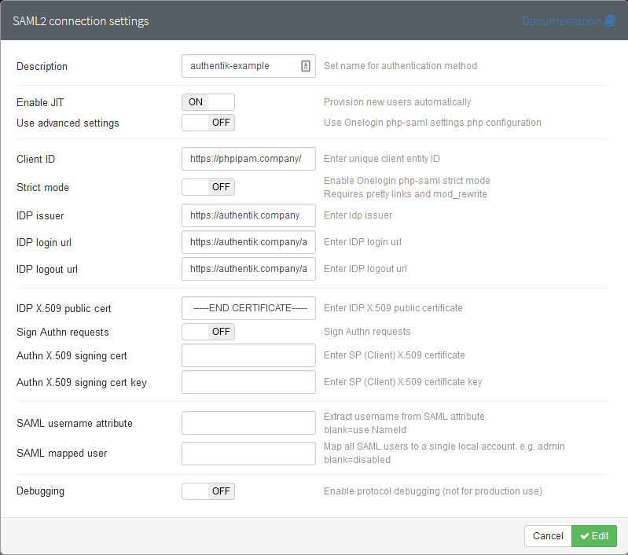
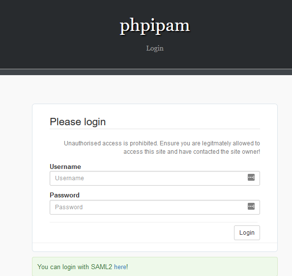
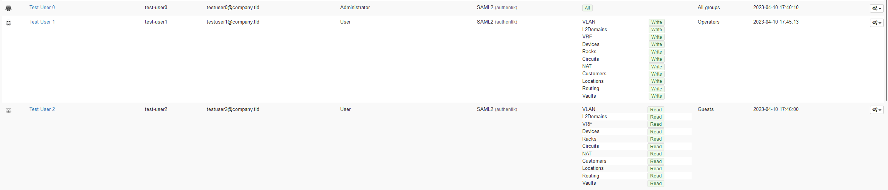

<span class="badge badge--secondary">Support level: Community</span>

## What is phpIPAM

From https://phpipam.net/

:::note
phpipam is an open-source web IP address management application (IPAM). Its goal is to provide light, modern and useful IP address management. It is php-based application with MySQL database backend, using jQuery libraries, ajax and HTML5/CSS3 features.
:::

## Preparation

The following placeholders will be used:

-   `phpipam.company` is the FQDN of the phpipam.
-   `authentik.company` is the FQDN of the authentik installation.
-   `test-user[0-2]` in place of actual usernames
-   `admin-permission-group` in place of your company naming convention
-   `operator-permission-group` in place of your company naming convention
-   `guest-permission-group` in place of your company naming convention

:::note
This is based on authentik 2023.3.1 and phpIPAM 1.5.2
Only settings that have been modified from default have been listed.
:::

## authentik Configuration

### Step 1 - User and Group creation

You need to ensure users and groups exist before we proceed with the next steps.

The groups are used for property mappings later to give the user the correct permission level in the application. For this documentation there is an example for each of the 3 main default permission levels and an easy way to visualise the differences between them.

1. **Create test-user 0**

    - username: test-user0
    - Name: Test User0
    - Email: test-user0@domain.company
    - path: users

2. **Create test-user 1**

    - username: test-user1
    - Name: Test User1
    - Email: test-user1@domain.company
    - path: users

3. **Create test-user 2**

    - username: test-user2
    - Name: Test User2
    - Email: test-user2@domain.company
    - path: users

4. **Create all required groups (under _Directory/Groups_)**

    - admin-permission-group
    - operator-permission-group
    - guest-permission-group

5. **Assign groups to users for testing**

    - admin-permission-group
        - Select Directory -> Groups
        - Select `admin-permission-group`
        - Select Add Existing user
        - Select test-user0
    - operator-permission-group
        - Select Directory -> Groups
        - Select `operator-permission-group`
        - Select Add Existing user
        - Select test-user1
    - guest-permission-group
        - Select Directory -> Groups
        - Select `guest-permission-group`
        - Select Add Existing user
        - Select test-user2

### Step 2 - Property Mapping creation

In order to support automatic user provisioning (JIT) with phpIPAM, additional SAML attributes need to be passed. See [phpipam docs](https://github.com/phpipam/phpipam/blob/master/doc/Authentication/SAML2.md#automatic-user-jit-provisioning) for more details about specific attributes to pass.

-   Select Property Mappings
-   Select Create -> SAML Property Mapping -> Next

1. display_name

    - Name: phpipam-display-name
    - SAML Attribute Name: display_name
    - Expression:

    ```python
    return user.name
    ```

2. email

    - Name: phpipam-email
    - SAML Attribute Name: email
    - Expression:

    ```python
    return user.email
    ```

3. is_admin

    - Name: phpipam-is-admin
    - SAML Attribute Name: is_admin
    - Expression:

    ```python
    return ak_is_group_member(request.user, name="admin-permission-group")
    ```

4. groups

    - Name: phpipam-groups
    - SAML Attribute Name: groups
    - Expression:

    ```python
    if ak_is_group_member(request.user, name="operator-permission-group"):
        return "Operators"
    elif ak_is_group_member(request.user, name="guest-permission-group"):
        return "Guests"
    ```

5. modules
    - Name: phpipam-modules
    - SAML Attribute Name: modules
    - Expression:
    ```python
    if ak_is_group_member(request.user, name="operator-permission-group"):
        return "*:2"
    elif ak_is_group_member(request.user, name="guest-permission-group"):
        return "*:1"
    ```


### Step 3 - Provider creation

-   Select Create -> SAML Provider
    -   Name: phpipam-saml
    -   Authorization flow: `default-provider-authorization-explicit-consent`
    -   Protocol Settings:
        -   ACS URL: https://phpipam.company/saml2/
        -   Issuer: https://authentik.company
        -   Service Provider Binding: Post
        -   Audience: https://phpipam.company/
    -   Advanced Protocol Settings:
        -   Signing Certificate: authentik: Self-signed Certificate
        -   Verification certificate: Leave Blank
        -   Property Mappings: Select All Available
        -   NameID Property Mapping: authentik default SAML Mapping: Username




### Step 4 - Application creation

Select Create

-   Name: phpipam-saml
-   Provider: phpipam-saml

Edit Policy Bindings to only allow users who have the groups assigned to them, access to login. Without this, any user can login and be given default no permissions in phpIPAM.

Select ipam-saml application

-   Select Policy / Group / User Bindings
    -   Add `admin-permission-group`
    -   Add `operator-permission-group`
    -   Add `guest-permission-group`

Leave all other settings as default


## phpIPAM Configuration

Login as the local administrator account at `phpipam.company`
Select Authentication Methods
Select Create New -> SAML2 Authentication

-   Description: authentik
-   Enable JIT: On
-   Use advanced settings: Off
-   Client ID: https://phpipam.company/
-   Strict Mode: Off
-   IDP Issuer: https://authentik.company
-   IDP Login url: https://authentik.company/application/saml/<application_name>/sso/binding/redirect/
-   IDP Logout url: https://authentik.company/application/saml/<application_name>/slo/binding/redirect/
-   IDP X.509 public cert: This will be the .pem contents of the cert used as the signing certificate
    1. To get this cert, access the authentik installation at authentik.company
    2. Select Applications -> Providers -> phpipam-saml
    3. Select Download signing certificate
    4. Paste in the contents of the signing certificate into if IDP X.509 field
-   Sign Authn requests: Off

Leave everything else as default. Save changes


### Test login


Browse to `phpipam.company`, select the SAML2 login hyperlink (or access directly from the authentik application menu)
From here, you should be able to login as each of the test-users and see the affects the saml attributes has with the permissions set. These can be fine tuned as needed by following the phpipam documentation, but should be enough to get a basic permissive installation working with authentik as the SAML provider.

