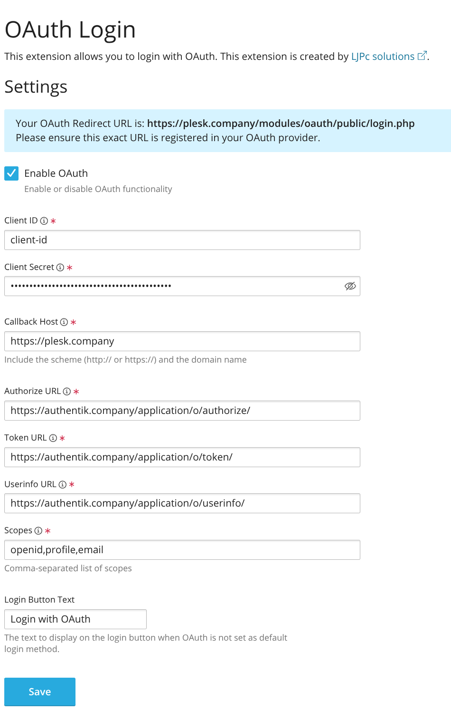
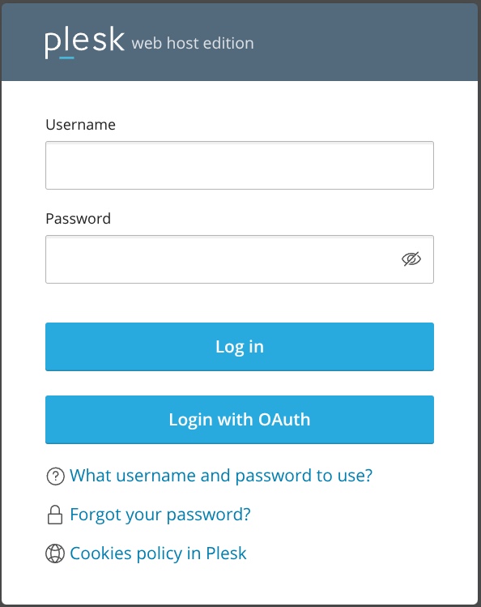

# Integrate with Plesk

Support level: Community

## What is Plesk

> Plesk is a web hosting platform with a control panel that helps manage servers, applications, and websites through a comprehensive graphical user interface. It provides tools for web professionals, IT administrators, and hosting companies to simplify the process of hosting and managing websites.
>
> -- https://www.plesk.com

:::caution
This integration is specifically designed for additional administrator accounts and does not work with the main administrator or customer accounts.
:::

## Preparation

The following placeholders are used in this guide:

- `plesk.company` is the FQDN of the Plesk server installation.
- `authentik.company` is the FQDN of the authentik installation.

## authentik configuration

1. In the Admin interface, navigate to **Applications -> Providers** to create an OAuth2/OpenID provider with these settings:

    - **Name:** plesk
    - **Redirect URI:** `https://plesk.company/modules/oauth/public/login.php`
    - **Signing Key:** Select any available key

2. Create an application using the provider.
    - Under **Applications** > **Applications** in the Admin interface, create a new application and configure it to use the provider created in the previous step.
    - Optionally, apply access restrictions to the application.
    - Set the **Launch URL** to `https://plesk.company/modules/oauth/public/login.php`.

## Plesk configuration

1. Install the OAuth Login extension from the Plesk Extension Store.

2. Navigate to the OAuth Login extension settings in Plesk:

    - Go to **Extensions** > **OAuth Login**
    - Enable OAuth authentication

3. Configure the OAuth settings:

    - **Client ID**: Enter the Client ID from your authentik provider
    - **Client Secret**: Enter the Client Secret from your authentik provider
    - **Callback Host**: Enter your Plesk server's FQDN (e.g., `https://plesk.company`)
    - **Authorize URL**: `https://authentik.company/application/o/authorize/`
    - **Token URL**: `https://authentik.company/application/o/token/`
    - **Userinfo URL**: `https://authentik.company/application/o/userinfo/`
    - **Scopes**: `openid,profile,email`
    - **Login Button Text**: Set your preferred text (e.g., "Login with Authentik")

    

4. Click **Save** to apply the settings.

## Security Considerations

- The integration only works for additional administrator accounts, not for:
    - The main administrator account
    - Customer accounts
    - Reseller accounts

## Configuration verification

To confirm that authentik is properly configured with Plesk:

1. Log out of Plesk
2. On the login page, you should see the OAuth login button
3. Click the OAuth login button
4. You should be redirected to authentik for authentication
5. After successful authentication, you should be logged into your Plesk administrator account

