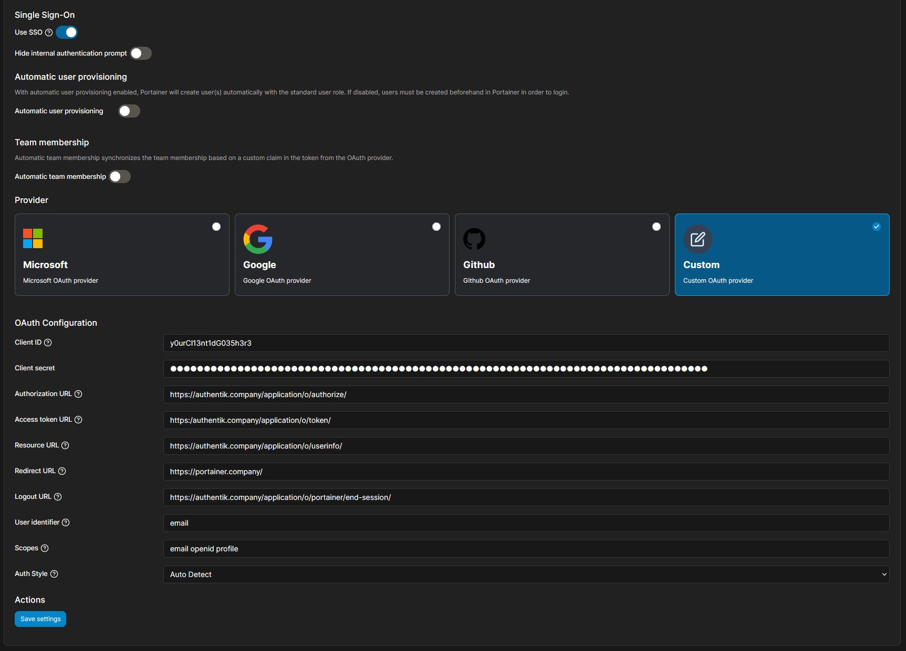

Support level: Community

## What is Portainer

> Portainer is a powerful, GUI-based Container-as-a-Service solution that helps organizations manage and deploy cloud-native applications easily and securely.
>
> -- https://www.portainer.io/

:::note
This is based on authentik 2021.7.3 and Portainer 2.6.x-CE. Portainer 2.6 supports OAuth without additional licenses, 1.x Series requires a paid license for OAuth.
:::

## Preparation

The following placeholders will be used:

-   `portainer.company` is the FQDN of Portainer.
-   `authentik.company` is the FQDN of authentik.

### Step 1 - authentik

In authentik, under _Providers_, create an _OAuth2/OpenID Provider_ with these settings:

:::note
Only settings that have been modified from default have been listed.
:::

**Protocol Settings**

-   Name: Portainer
-   Client ID: Copy and Save this for Later
-   Client Secret: Copy and Save this for later
-   Redirect URIs/Origins: `https://portainer.company/`

### Step 2 - Portainer

In Portainer, under _Settings_, _Authentication_, Select _OAuth_ and _Custom_

-   Client ID: Client ID from step 1
-   Client Secret: Client Secret from step 1
-   Authorization URL: `https://authentik.company/application/o/authorize/`
-   Access Token URL: `https://authentik.company/application/o/token/`
-   Redirect URL: `https://portainer.company`
-   Resource URL: `https://authentik.company/application/o/userinfo/`
-   Logout URL: `https://authentik.company/application/o/portainer/end-session/`
-   User Identifier: `preferred_username` (Or `email` if you want to use email addresses as identifiers)
-   Scopes: `email openid profile`

:::note
Portainer by default shows commas between each item in the Scopes field. Do **NOT** use commas. Use a _space_
:::

### Step 3 - authentik

In authentik, create an application which uses this provider. Optionally apply access restrictions to the application using policy bindings.

-   Name: Portainer
-   Slug: portainer
-   Provider: Portainer
-   Launch URL: https://portainer.company

## Notes

:::note
Portainer Reference link: https://documentation.portainer.io/v2.0/auth/oauth/
:::
