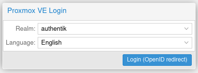

## What is Proxmox VE

From https://pve.proxmox.com/wiki/Main_Page

:::note
Proxmox Virtual Environment is an open source server virtualization management solution based on QEMU/KVM and LXC. You can manage virtual machines, containers, highly available clusters, storage and networks with an integrated, easy-to-use web interface or via CLI. Proxmox VE code is licensed under the GNU Affero General Public License, version 3. The project is developed and maintained by Proxmox Server Solutions GmbH.
:::

:::warning
This requires Proxmox VE 7.0 or newer.
:::

## Preparation

The following placeholders will be used:

-   `proxmox.company` is the FQDN of the Proxmox VE server.
-   `authentik.company` is the FQDN of the authentik install.

### Step 1

Under _Providers_, create an OAuth2/OpenID provider with these settings:

-   Name: proxmox
-   Client Type: Confidential
-   Redirect URI: `https://proxmox.company:8006` (Note the absence of the trailing slash, and the inclusion of the webinterface port)

### Step 2

Create an application which uses this provider. Optionally apply access restrictions to the application.

Set the Launch URL to `https://promox.company:8006`.

## Proxmox VE Setup

Proxmox VE allows configuration of authentication sources using the web interface (under Datacenter -> Permissions -> Realms).

Another way is to use the CLI. SSH into any Proxmox cluster node, and issue the following command:

`pveum realm add authentik --type openid --issuer-url https://authentik.company/application/o/proxmox/ --client-id xxx --client-key xxx --username-claim username --autocreate 1`

You can find the Issuer URL on the Provider Metadata tab in authentik. You can find the Client ID and Key on the Provider Edit dialog in authentik.

After configuring the source in Proxmox, any user that logs in to Proxmox for the first time automatically gets an user named `<authentik username>@<pve realm name>`. In this example,
authentik user `bob` will get an user named `bob@authentik` in Proxmox. You can then assign Permissions as normally in Proxmox. You can also pre-create the users in Proxmox if you want
the user to be able to perform actions immediately after first login.

There is no way to directly trigger an OpenID Connect login in Proxmox, but if you set the source as 'default', it will be automatically selected on the Proxmox login screen.

