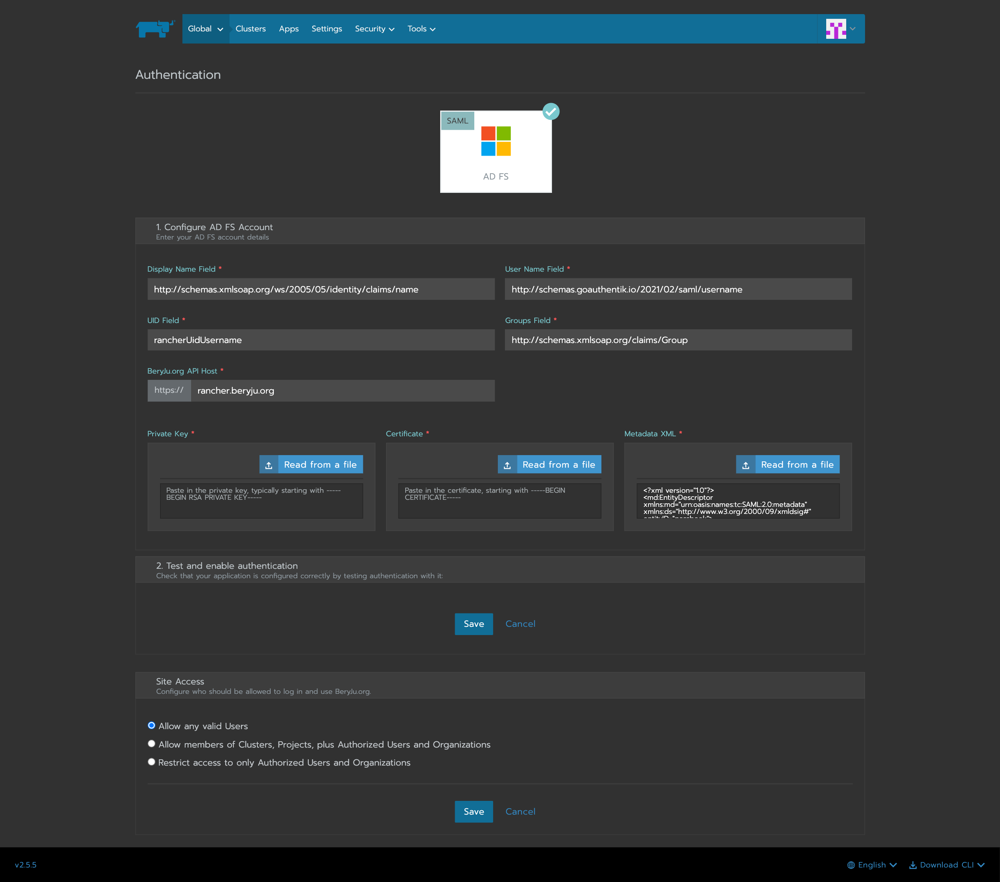

<span class="badge badge--primary">Support level: authentik</span>

## What is Rancher

> An enterprise platform for managing Kubernetes Everywhere
> Rancher is a platform built to address the needs of the DevOps teams deploying applications with Kubernetes, and the IT staff responsible for delivering an enterprise-critical service.
>
> -- https://rancher.com/products/rancher

## Preparation

The following placeholders will be used:

-   `rancher.company` is the FQDN of the Rancher install.
-   `authentik.company` is the FQDN of the authentik install.

Under _Customization_ -> _Property Mappings_, create a _SAML Property Mapping_. Give it a name like "SAML Rancher User ID". Set the SAML name to `rancherUidUsername` and the expression to the following

```python
return f"{user.pk}-{user.username}"
```

Create an application in authentik. Set the Launch URL to `https://rancher.company`, as Rancher does not currently support IdP-initiated logins.

Create a SAML provider with the following parameters:

-   ACS URL: `https://rancher.company/v1-saml/adfs/saml/acs`
-   Audience: `https://rancher.company/v1-saml/adfs/saml/metadata`
-   Issuer: `authentik`
-   Service Provider Binding: `Post`
-   Property mappings: Select all default mappings and the mapping you've created above.
-   Signing Certificate: Select the authentik self-signed certificate.

You can of course use a custom signing certificate, and adjust durations.

## Rancher

In Rancher, navigate to _Global_ -> _Security_ -> _Authentication_, and select ADFS.

Fill in the fields

-   Display Name Field: `http://schemas.xmlsoap.org/ws/2005/05/identity/claims/name`
-   User Name Field: `http://schemas.goauthentik.io/2021/02/saml/username`
-   UID Field: `rancherUidUsername`
-   Groups Field: `http://schemas.xmlsoap.org/claims/Group`

For the private key and certificate, you can either generate a new pair (in authentik, navigate to _Identity & Cryptography_ -> _Certificates_ and select Generate), or use an existing pair.

Copy the metadata from authentik, and paste it in the metadata field.

Click on save to test the authentication.


