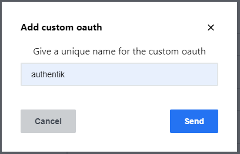
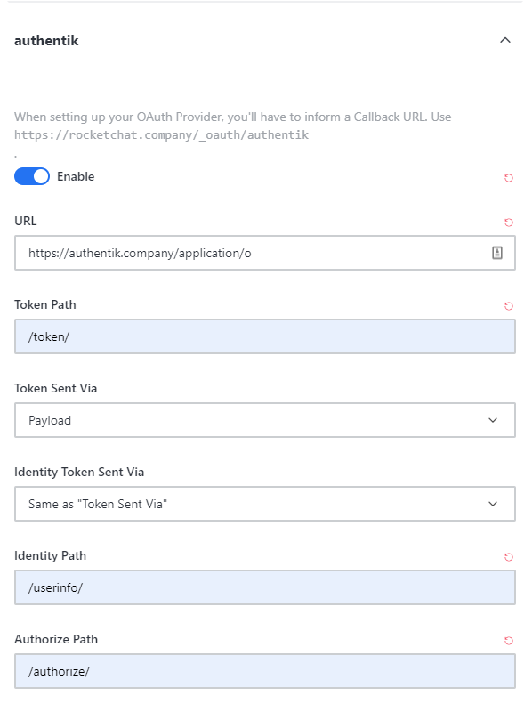
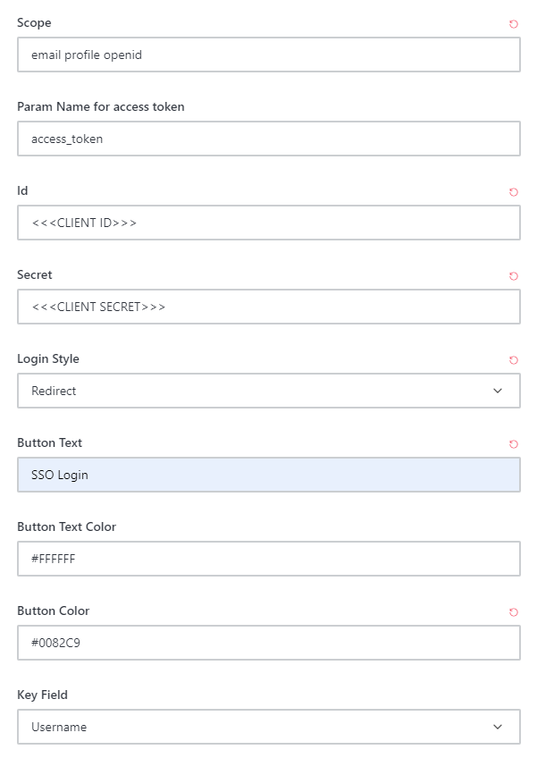
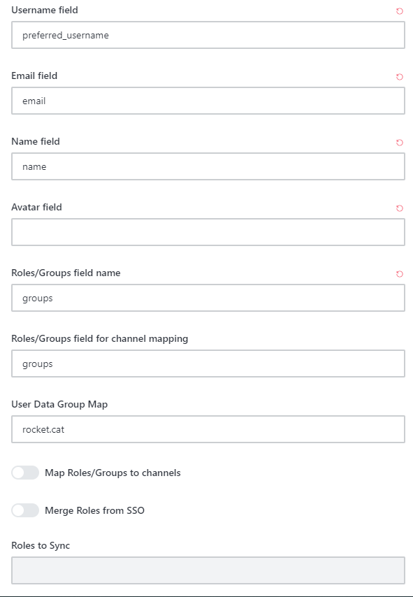
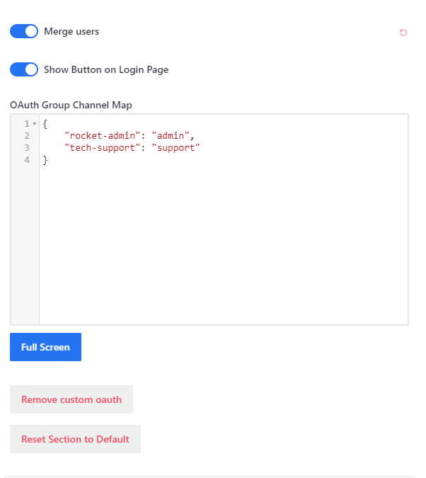

## What is Rocket.chat

> Rocket.Chat is an open-source fully customizable communications platform developed in JavaScript for organizations with high standards of data protection. It is licensed under the MIT License with some other licenses mixed in. See [Rocket.chat GitHub](https://github.com/RocketChat/Rocket.Chat/blob/develop/LICENSE) for licensing information.
>
> -- https://github.com/RocketChat/Rocket.Chat

:::note
This is based on authentik 2022.3.1 and Rocket.chat 4.5.1 using the [Docker-Compose install](https://docs.rocket.chat/quick-start/installing-and-updating/rapid-deployment-methods/docker-and-docker-compose/docker-containers). Instructions may differ between versions.
:::

## Preparation

The following placeholders are used in this guide:

- `rocket.company` is the FQDN of Rocket.chat installation.
- `authentik.company` is the FQDN of authentik installation.

:::note
This documentation lists only the settings that you need to change from their default values. Be aware that any changes other than those explicitly mentioned in this guide could cause issues accessing your application.
:::

## authentik configuration

To support the integration of Rocket.chat with authentik, you need to create an application/provider pair in authentik.

### Create an application and provider in authentik

1. Log in to authentik as an admin, and open the authentik Admin interface.
2. Navigate to **Applications** > **Applications** and click **Create with Provider** to create an application and provider pair. (Alternatively you can first create a provider separately, then create the application and connect it with the provider.)

- **Application**: provide a descriptive name, an optional group for the type of application, the policy engine mode, and optional UI settings.
- **Choose a Provider type**: select **OAuth2/OpenID Connect** as the provider type.
- **Configure the Provider**: provide a name (or accept the auto-provided name), the authorization flow to use for this provider, and the following required configurations.
    - Note the **Client ID**,**Client Secret**, and **slug** values because they will be required later.
    - Set a `Strict` redirect URI to <kbd>https://<em>rocket.company</em>/\_oauth/authentik</kbd>.
    - Select any available signing key.
- **Configure Bindings** _(optional)_: you can create a [binding](/docs/add-secure-apps/flows-stages/bindings/) (policy, group, or user) to manage the listing and access to applications on a user's **My applications** page.

3. Click **Submit** to save the new application and provider.

## Rocket.chat configuration

:::note
Only settings that have been modified from default have been listed.

You may have different settings for some of the group and role mapping for advanced configurations. The settings below are the base settings to connect authentik and Rocket.chat.
:::

In Rocket.chat, follow the procedure below:

1. Log in as a System Administrator, click on your avatar, and choose _Administration_

2. Scroll down and click on _OAuth_

3. In the top right corner, click _Add custom oauth_

4. Give your new oauth the name of _Authentik_, then click _Send_

5. Scroll down to the new OAuth application, expand the dropdown, and enter the following settings:

    - Enable: Turn the radio button to the _on_ position
    - URL: https://authentik.company/application/o
    - Token Path: /token/
    - Token Sent Via: Payload
    - Identity Token Sent Via: Same as "Token Sent Via"
    - Identity Path: /userinfo/
    - Authorize Path: /authorize/
    - Scope: email profile openid
    - Param Name for access token: access_token
    - Id: _THIS IS THE CLIENT ID YOU COPIED FROM STEP 1 in authentik_
    - Secret: _THIS IS THE CLIENT SECRET YOU COPIED FROM STEP 1 in authentik_
    - Login Style: Redirect
    - Button Text: _Fill in with what you want the SSO button to say_
    - Button Text Color: _Hex Color for Text on the SSO login button_
    - Button Color: _Hex Color for the SSO login button_
    - Key Field: Username
    - Username field: preferred_username
    - Email field: email
    - Name field: name
    - Roles/Groups field name: groups
    - Roles/Groups field for channel mapping: groups
    - User Data Group Map: rocket.cat
    - Merge users: Turn the radio button to the _on_ position
    - Show Button on Login Page: Turn the radio button to the _on_ position

    

    

    

    

6. Click _Save changes_ in the top right corner of the screen

### Step 4 (Optional)

:::note
By default, Rocket.chat will attempt to use two-factor authentication with any new user coming in to the system and allows users to change their information
:::

**To disable changing user information and other options inside Rocket.chat:**

Navigate to the _Accounts_ settings to change the following:

- Allow Name Change: Off
- Allow Username Change: Off
- Allow Email Change: Off
- Allow Password Change for OAuth Users: Off

**If you are using Two Factor authentication through authentik:**

Navigate to the _Accounts_ settings, Scroll Down to Two Factor Authentication and turn off _Enable Two Factor Authentication_

**Registration Options**
Navigate to the _Accounts_ settings, Scroll Down to Registration and choose your [registration options](https://docs.rocket.chat/guides/administration/settings/account-settings#registration), such as:

- Registration Form: Disabled
