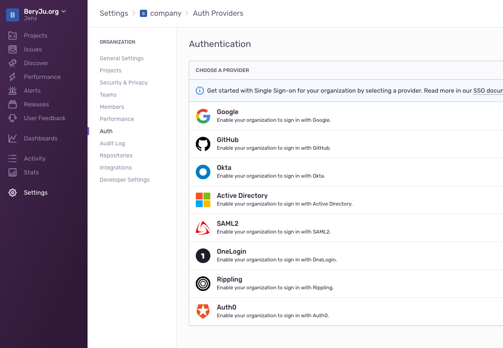

Support level: authentik

## What is Sentry

> Sentry provides self-hosted and cloud-based error monitoring that helps all software teams discover, triage, and prioritize errors in real-time.
> One million developers at over fifty thousand companies already ship better software faster with Sentry. Won’t you join them?
>
> -- https://sentry.io

## Preparation

The following placeholders will be used:

-   `sentry.company` is the FQDN of the Sentry install.
-   `authentik.company` is the FQDN of the authentik install.

Create an application in authentik. Create a SAML Provider with the following values

-   ACS URL: `https://sentry.company/saml/acs/<sentry organisation name>/`
-   Issuer: `authentik`
-   Service Provider Binding: `Post`
-   Audience: `https://sentry.company/saml/metadata/<sentry organisation name>/`

Under _Advanced protocol settings_, set the following:

-   Signing Certificate: Select any certificate.
-   Property Mapping: Select all Managed Mappings

## Sentry

**This guide assumes you've installed Sentry using [getsentry/self-hosted](https://github.com/getsentry/self-hosted)**

Navigate to Settings -> Auth, and click on Configure next to SAML2

In authentik, get the Metadata URL by right-clicking `Download Metadata` and selecting Copy Link Address, and paste that URL into Sentry.

On the next screen, input these Values

-   IdP User ID: `http://schemas.goauthentik.io/2021/02/saml/uid`
-   User Email: `http://schemas.xmlsoap.org/ws/2005/05/identity/claims/emailaddress`
-   First Name: `http://schemas.xmlsoap.org/ws/2005/05/identity/claims/name`

After confirming, Sentry will authenticate with authentik, and you should be redirected back to a page confirming your settings.
