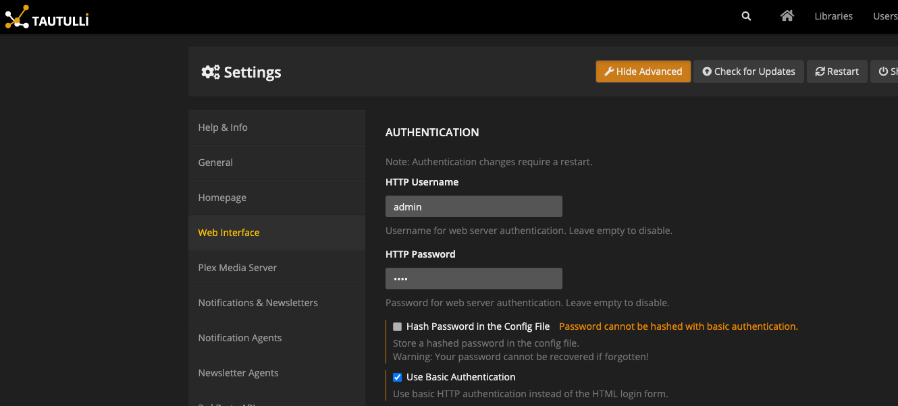

<span class="badge badge--secondary">Support level: Community</span>

## What is Tautulli

> Tautulli is an open-source monitoring and analytics tool for Plex Media Server, providing detailed insights into media usage, user activity, and server performance, helping users optimize their Plex experience and track viewing habits.
>
> -- https://tautulli.com/

## Preparation

The following placeholders will be used:

-   `tautulli.company` is the FQDN of the Tautulli install.
-   `authentik.company` is the FQDN of the authentik install.

## authentik Setup

Because Tautulli requires valid HTTP Basic credentials, you must save your HTTP Basic Credentials in authentik. The recommended way to do this is to create a Group. Name the group "Tautulli Users", for example. For this group, add the following attributes:

```yaml
tautulli_user: username
tautulli_password: password
```

Add all Tautulli users to the Group. You should also create a Group Membership Policy to limit access to the application.

Create an application in authentik. Create a Proxy provider with the following parameters:

-   Internal host

    If Tautulli is running in docker, and you're deploying the authentik proxy on the same host, set the value to `http://tautulli:3579`, where tautulli is the name of your container.

    If Tautulli is running on a different server to where you are deploying the authentik proxy, set the value to `http://tautulli.company:3579`.

-   External host

    Set this to the external URL you will be accessing Tautulli from.

Enable the `Set HTTP-Basic Authentication` option. Set and `HTTP-Basic Username` and `HTTP-Basic Password` to `tautulli_user` and `tautulli_password` respectively. These values can be chosen freely, `tautulli_` is just used as a prefix for clarity.

## Tautulli Setup

In Tautulli, navigate to Settings and enable the "Show Advanced" option. Navigate to "Web Interface" on the sidebar, and ensure the Option `Use Basic Authentication` is checked.



Save the settings, and restart Tautulli if prompted.

Afterwards, you need to deploy an Outpost in front of Tautulli, as described [here](../sonarr/)
