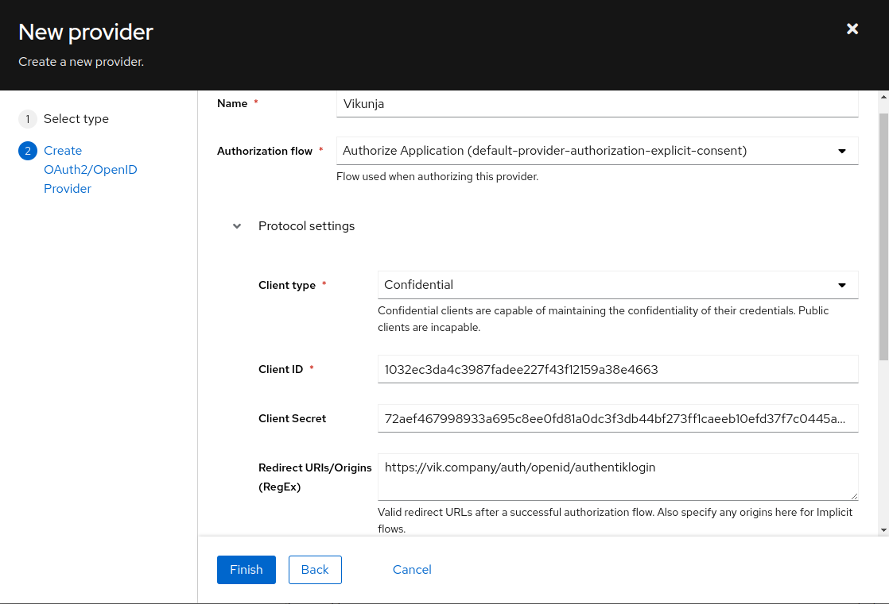

## What is Vikunja

> Vikunja is an Open-Source, self-hosted To-Do list application for all platforms. It is licensed under the GPLv3.
>
> -- https://vikunja.io/

:::note
This is based on authentik 2021.7.3 and Vikunja V0.17.1 using the Docker-Compose install https://vikunja.io/docs/full-docker-example/. Instructions may differ between versions.
:::

## Preparation

The following placeholders are used in this guide:

- `vik.company` is the FQDN of Vikunja.
- `authentik.company` is the FQDN of authentik.
- `authentik Login` is the name shown on Vikunja set in config.yml, and used for the Redirect URI. If the name set in config.yml has capitalization or spaces like in this example, they will be set to lowercase and no spaces in the callback URL, like `authentiklogin`.

:::note
This documentation lists only the settings that you need to change from their default values. Be aware that any changes other than those explicitly mentioned in this guide could cause issues accessing your application.
:::

## authentik configuration

To support the integration of Vikunja with authentik, you need to create an application/provider pair in authentik.

### Create an application and provider in authentik

1. Log in to authentik as an admin, and open the authentik Admin interface.
2. Navigate to **Applications** > **Applications** and click **Create with Provider** to create an application and provider pair. (Alternatively you can create only an application, without a provider, by clicking **Create.)**

- **Application**: provide a descriptive name, an optional group for the type of application, the policy engine mode, and optional UI settings.
- **Choose a Provider type**: select **OAuth2/OpenID Connect** as the provider type.
- **Configure the Provider**: provide a name (or accept the auto-provided name), the authorization flow to use for this provider, and the following required configurations.
    - Note the **Client ID**,**Client Secret**, and **slug** values because they will be required later.
    - Set a `Strict` redirect URI to <kbd>https://<em>vik.company</em>/auth/openid/authentiklogin</kbd>.
    - Select any available signing key.
- **Configure Bindings** _(optional)_: you can create a [binding](/docs/add-secure-apps/flows-stages/bindings/) (policy, group, or user) to manage the listing and access to applications on a user's **My applications** page.

3. Click **Submit** to save the new application and provider.



## Vikunja configuration

Edit/Create your `config.yml` file for Vikunja. Local authentication can be safely disabled in the Local block if all users must login through authentik, in this example it is left enabled.

Incorporate the following example Auth block into your `config.yml`:

```bash
auth:
  # Local authentication will let users log in and register (if enabled) through the db.
  # This is the default auth mechanism and does not require any additional configuration.
  local:
    # Enable or disable local authentication
    enabled: true
  # OpenID configuration will allow users to authenticate through a third-party OpenID Connect compatible provider.<br/>
  # The provider needs to support the `openid`, `profile` and `email` scopes.<br/>
  # **Note:** Some openid providers (like gitlab) only make the email of the user available through openid claims if they have set it to be publicly visible.
  # If the email is not public in those cases, authenticating will fail.
  # **Note 2:** The frontend expects to be redirected after authentication by the third party
  # to <frontend-url>/auth/openid/<auth key>. Please make sure to configure the redirect url with your third party
  # auth service accordingly if you're using the default Vikunja frontend.
  # Take a look at the [default config file](https://github.com/go-vikunja/api/blob/main/config.yml.sample) for more information about how to configure openid authentication.
  openid:
    # Enable or disable OpenID Connect authentication
    enabled: true
    # A list of enabled providers
    providers:
      # The name of the provider as it will appear in the frontend.
      - name: "authentik Login"
        # The auth url to send users to if they want to authenticate using OpenID Connect.
        authurl: https://authentik.company/application/o/vikunja/
        # The client ID used to authenticate Vikunja at the OpenID Connect provider.
        clientid: THIS IS THE CLIENT ID YOU COPIED FROM STEP 1 in authentik
        # The client secret used to authenticate Vikunja at the OpenID Connect provider.
        clientsecret: THIS IS THE CLIENT SECRET YOU COPIED FROM STEP 1 in authentik
```

:::note
You need to restart the Vikunja API after applying the OpenID configuration to Vikunja.
:::

:::note
Vikunja Configuration Reference: https://vikunja.io/docs/config-options/#auth
:::

### Step 3

In authentik, create an application which uses this provider. Optionally apply access restrictions to the application using policy bindings.

- Name: Vikunja
- Slug: vikunja
- Provider: vikunja
- Launch URL: https://vik.company
