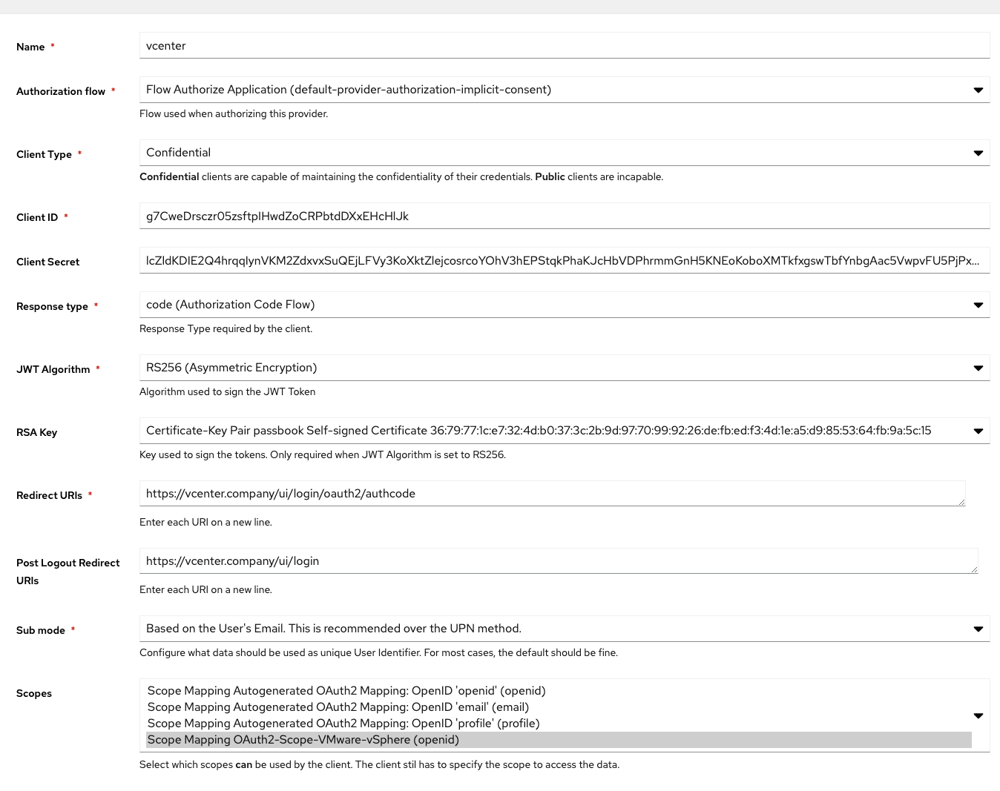
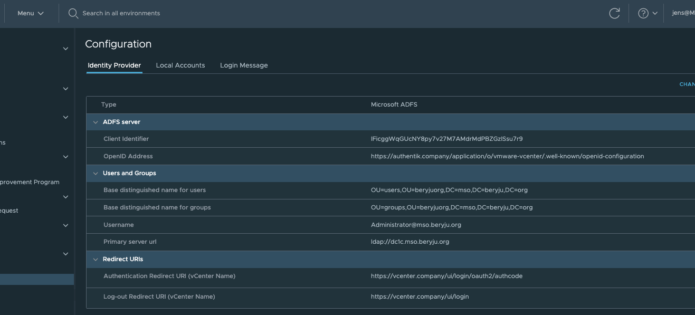

# VMware vCenter

<span class="badge badge--secondary">Support level: Community</span>

## What is vCenter

> vCenter Server is the centralized management utility for VMware, and is used to manage virtual machines, multiple ESXi hosts, and all dependent components from a single centralized location. VMware vMotion and svMotion require the use of vCenter and ESXi hosts.
>
> -- https://en.wikipedia.org/wiki/VCenter

:::caution
This requires VMware vCenter 8.03 or newer.
:::

:::note
It seems that the vCenter still needs to be joined to the Active Directory Domain, otherwise group membership does not work correctly. We're working on a fix for this, for the meantime your vCenter should be part of your Domain.
:::

## Preparation

The following placeholders will be used:

-   `vcenter.company` is the FQDN of the vCenter server.
-   `authentik.company` is the FQDN of the authentik install.

Since vCenter only allows OpenID-Connect in combination with Active Directory/LDAP, it is recommended to have authentik sync with the same Active Directory. You also have the option of connecting to an authentik managed LDAP outpost for user management.

## authentik configuration

### Step 1

Under _Customization_ -> _Property Mappings_, create a _Scope Mapping_. Give it a name like "OIDC-Scope-VMware-vCenter". Set the scope name to `openid` and the expression to the following

```python
return {
  "domain": "<your active directory domain>",
}
```

If you are using an authentik managed LDAP outpost you can use the following expression in your property mapping. This will correctly return the `groups` claim as a list of LDAP DNs instead of their names.

```python
ldap_base_dn = "DC=ldap,DC=goauthentik,DC=io"
groups = []
for group in request.user.ak_groups.all():
    group_dn = f"CN={group.name},dc=groups,{ldap_base_dn}"
    groups.append(group_dn)
return {
    "name": request.user.name,
    "email": request.user.email,
    "given_name": request.user.name,
    "preferred_username": request.user.username,
    "nickname": request.user.username,
    "groups": groups,
    "domain": "ldap.goauthentik.io"
}
```

### Step 2

:::note
If your Active Directory Schema is the same as your Email address schema, skip to Step 3.
:::

Under _Sources_, click _Edit_ and ensure that "authentik default Active Directory Mapping: userPrincipalName" has been added to your source.

### Step 3

Create an application and an OAuth2/OpenID provider, using the authetntik Wizard.

1. Log into authentik as an admin, and navigate to Applications --> Applications, and then click **Create with Wizard**.

2. In the Wizard, follow the prompts to create an applcation and its provider, with these specific points"

- Select OIDC as the provider type.
- Ensure that the signing key is provided (or you accet the default to authentik's Self-signed Certificate).
- Ensure that redirect URI Setting is left empty.

3. Click **Submit** to create the application and provider, and then click **Close** to close the Wizard.

Set the Launch URL to `https://vcenter.company/ui/login/oauth2`. This will skip vCenter's User Prompt and directly log you in.

:::caution
This Launch URL only works for vCenter < 7.0u2. If you're running 7.0u2 or later, set the launch URL to `https://vcenter.company/ui/login`
:::

Optionally apply access restrictions to the application.

Create the provider with these settings:

-   Redirect URI: `https://vcenter.company/ui/login/oauth2/authcode`
-   Sub Mode: If your Email address Schema matches your UPN, select "Based on the User's Email...", otherwise select "Based on the User's UPN...". If you are using authentik's managed LDAP outpost, chose "Based on the User's username"
-   Scopes: Select the Scope Mapping you've created in Step 1
-   Signing Key: Select any available key



## vCenter Setup

Login as local Administrator account (most likely ends with vsphere.local). Using the Menu in the Navigation bar, navigate to _Administration -> Single Sing-on -> Configuration_.

Click on _Change Identity Provider_ in the top-right corner.

In the wizard, select "Microsoft ADFS" and click Next.

Fill in the Client Identifier and Shared Secret from the Provider in authentik. For the OpenID Address, click on _View Setup URLs_ in authentik, and copy the OpenID Configuration URL.

On the next page, fill in your Active Directory Connection Details. These should be similar to what you have set in authentik.



If your vCenter was already setup with LDAP beforehand, your Role assignments will continue to work.
