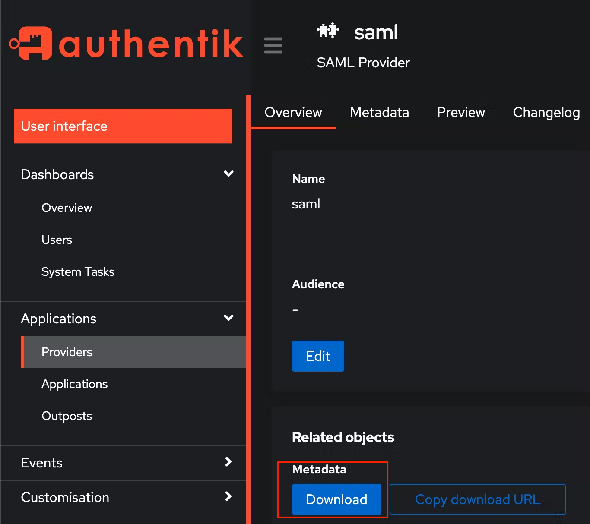

<span class="badge badge--secondary">Support level: Community</span>

## What is wazuh

> wazuh is an open source Security Information and Event Management System that also has (extended) Endpoint Detection & Response (XDR) capabilities, as well as components of a Network Intrusion & Detection System (NIDS).
>
> -- https://wazuh.com

:::note
We assume that you already have wazuh and authentik installed/setup and now want to integrate authentik as your IDP solution to have SSO within wazuh.
:::

## Preparation

The following placeholders will be used:

-   `wazuh.company` is the FQDN of the wazuh server instance.
-   `authentik.company` is the FQDN of the authentik install.

While wazuh allows both LDAP and SAML integration, in this post we will only walk through the SAML integration.

### Step 1 - certificates

The first step would be to add a certificate for wazuh.

You can generate a new one under `System` -> `Certificates` -> `Generate`

Add a name, set the validity period to 365 days and click `Generate`


If all goes well authentik will display a message like the one below


### Step 2 - saml provider

Now add a SAML provider - you can find the options under `Applications` -> `Providers`


Select SAML Provider and click Next


Add a descriptive name, select the appropriate Authentication/Authorization flow, adjust the ACS URL to contain the IP/hostname of your wazuh installation and add `/_opendistro/_security/saml/acs` to the end.

`https://<WAZUH_IP_OR_HOSTNAME>/_opendistro/_security/saml/acs`

also make sure to give it an appropriate `EntityID` name (`issuer`), you will need that later and a valid option is e.g. `wazuh-saml`

Select `Post` as the `Service Provider Binding` and move on to the advanced protocol settings.


The last step is to select the previously created `Signing Certificate` from the dropdown list and leave the rest of the configurations as default for now.


### Step 3 - property mapping

Time to create a Property Mapping - this is a custom function that takes group/user data from authentik and provides it to wazuh in a structured way.

We will map a group membership - `wazuh-admins` - as a backend role for RBAC in wazuh using Property Mapping - `Customization` -> `Property Mappings`

`Name: wazuh property mapping`

`SAML Attribute Role: Roles`


```python
if ak_is_group_member(request.user, name="wazuh-admins"):
  yield "wazuh-admin"
```

Make sure to adjust the provider to include the newly created property mapping in the `Advanced protocol settings`.


### Step 4 - saml application

Now create an application to use the newly created provider. `Applications` -> `Applications` -> `Create`

`Name: wazuh-saml`
`Slug: wazuh-saml`
`Provider: SAML`
`Policy Engine: any`


You can change the UI / upload a logo so that in the applications overview you have a nice layout and can easily identify the new wazuh app.


### Step 5 - metadata + wazuh opensearch-security configuration

Now download the metadata file `saml_authentik_meta.xml` from the `Applications` -> `Provider` -> `Related Objects` -> `Download`

and copy/save it on the wazuh server - ideally under `/etc/wazuh-indexer/opensearch-security/idp-metadata.xml`


Next up change the `/etc/wazuh-indexer/opensearch-security/config.yml` and make sure it looks like the one below

-   you need to adjust the `metadata_file` if your name differs from the one shown above/below
-   `entity_id` needs to change twice, once in the `idp` section and once in the `sp` section - you can look it up in the metadata xml file - search for `entityID`
    
-   adapt the `kibana_url` to match your wazuh dashboard url - e.g. `https://wazuh.myhomelab.com/`
-   copy/paste the `exchange_key`, you can get it from the metadata file (find the key between the `<ds:X509Certificate></ds:X509Certificate>` tags, it usually starts with MII...) - DO NOT FORGET TO PUT QUOTES AROUND THE CERTIFICATE
-   make sure to adjust the ownership and access rights via the following commands:

```bash
sudo chown wazuh-indexer:wazuh-indexer /etc/wazuh-indexer/opensearch-security/idp-metadata.xml

sudo chmod 640 /etc/wazuh-indexer/opensearch-security/idp-metadata.xml
```

```yml
authc:
  basic_internal_auth_domain:
    description: "Authenticate via HTTP Basic + SAML against internal users database"
    http_enabled: true
    transport_enabled: true b
    order: 0
    http_authenticator:
      type: basic
      challenge: false
    authentication_backend:
      type: intern
  saml_auth_domain:
    http_enabled: true
    transport_enabled: false
    order: 1
    http_authenticator:
      type: saml
      challenge: true
      config:
        idp:
          metadata_file: "/etc/wazuh-indexer/opensearch-security/idp-metadata.xml"
          entity_id: "wazuh-saml"
        sp:
          entity_id: "wazuh-saml"
        kibana_url: "https://<YOUR_WAZUH_IP_OR_HOSTNAME>"
        roles_key: Roles
        exchange_key: "MIIGIODCCA+ygAwIBAgITREIpdNn++usuy4Gq5g0W2/SQs..."
     authentication_backend:
       type: noop
```

### Step 6 - securityadmin.sh

After you save the `config.yml` you need to restart the wazuh manager and tell it to load the modified file - this can be done automagically using the `securityadmin.sh` wazuh provides with the following command:

```bash
export JAVA_HOME=/usr/share/wazuh-indexer/jdk/ && bash /usr/share/wazuh-indexer/plugins/opensearch-security/tools/securityadmin.sh -f /etc/wazuh-indexer/opensearch-security/config.yml -icl -key /etc/wazuh-indexer/certs/admin-key.pem -cert /etc/wazuh-indexer/certs/admin.pem -cacert /etc/wazuh-indexer/certs/root-ca.pem -h localhost -nhnv
```

If all goes well this shows `Done with success` in the end

### Step 7 - roles_mapping.yml

In order to map the backend roles from authentik to wazuh specific roles you need to adjust the `/etc/wazuh-indexer/opensearch-security/roles_mapping.yml`

Open the file and scroll to the following section:


under `backend_roles` add `wazuh-admin` and check that reserved is `false` + the rest looks like below:

```yml
all_access:
    reserved: false
    hidden: false
    backend_roles:
        - "wazuh-admin"
        - "admin"
    hosts: []
    users: []
    and_backend_roles: []
    description: "Maps admin to all_access"
```

save the file and use the securityadmin.sh with the following command to load the adjusted `roles_mapping.yml`:

```bash
export JAVA_HOME=/usr/share/wazuh-indexer/jdk/ && bash /usr/share/wazuh-indexer/plugins/opensearch-security/tools/securityadmin.sh -f /etc/wazuh-indexer/opensearch-security/roles_mapping.yml -icl -key /etc/wazuh-indexer/certs/admin-key.pem -cert /etc/wazuh-indexer/certs/admin.pem -cacert /etc/wazuh-indexer/certs/root-ca.pem -h localhost -nhnv
```

If all goes well this shows `Done with success` in the end

### Step 8 - wazuh.yml

Check `/usr/share/wazuh-dashboard/data/wazuh/config/wazuh.yml` and make sure that `run_as` is set to `false`.


### Step 9 - security role mapping

open the wazuh dashboard - click on the downward pointing triangle next to the wazuh logo then on `Security` and `Roles mapping`.

We will now add a new role mapping. Give it any descriptive name and then add the respective Roles. In this case `administrator` is the name,  and add a new custom rule at the bottom that matches (`FIND`) the `user_name` to `wazuh-admin`.


### Step 10 - final step - opensearch_dashboards.yml

The last step is to modify `/etc/wazuh-dashboard/opensearch_dashboards.yml` and add three lines to the bottom of the file:

```yml
opensearch_security.auth.type: "saml"
server.xsrf.allowlist:
    [
        "/_opendistro/_security/saml/acs",
        "/_opendistro/_security/saml/logout",
        "/_opendistro/_security/saml/acs/idpinitiated",
    ]
opensearch_security.session.keepalive: false
```


If all went well you should now only have to restart the wazuh dashboard

`systemctl restart wazuh-dashboard`

And then you should be greeted by the authentik login screen when you try to connect to the dashboard.

