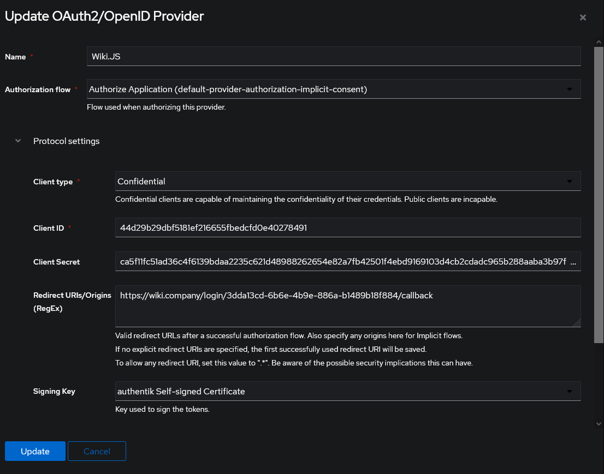
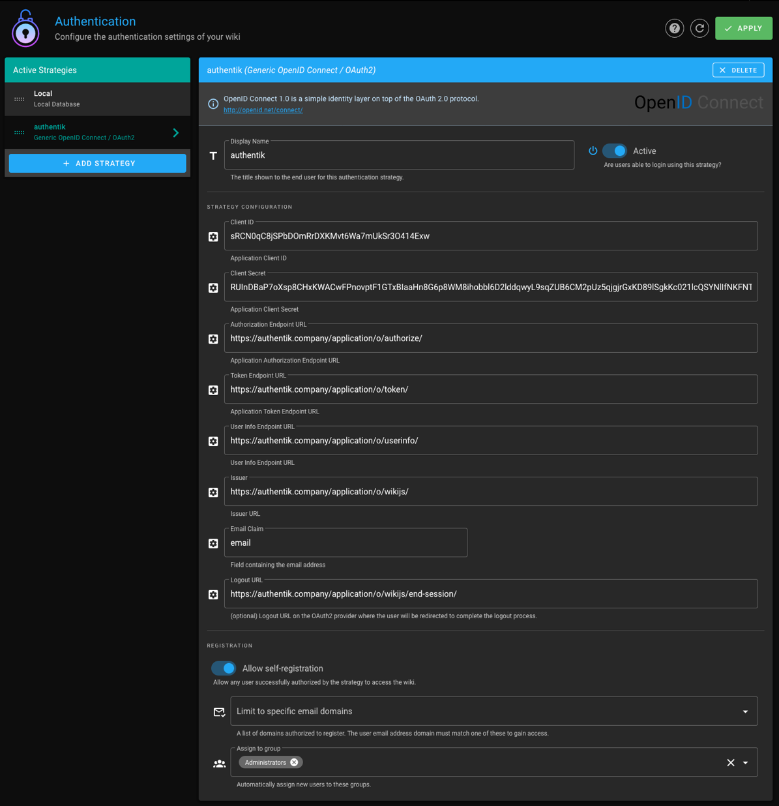
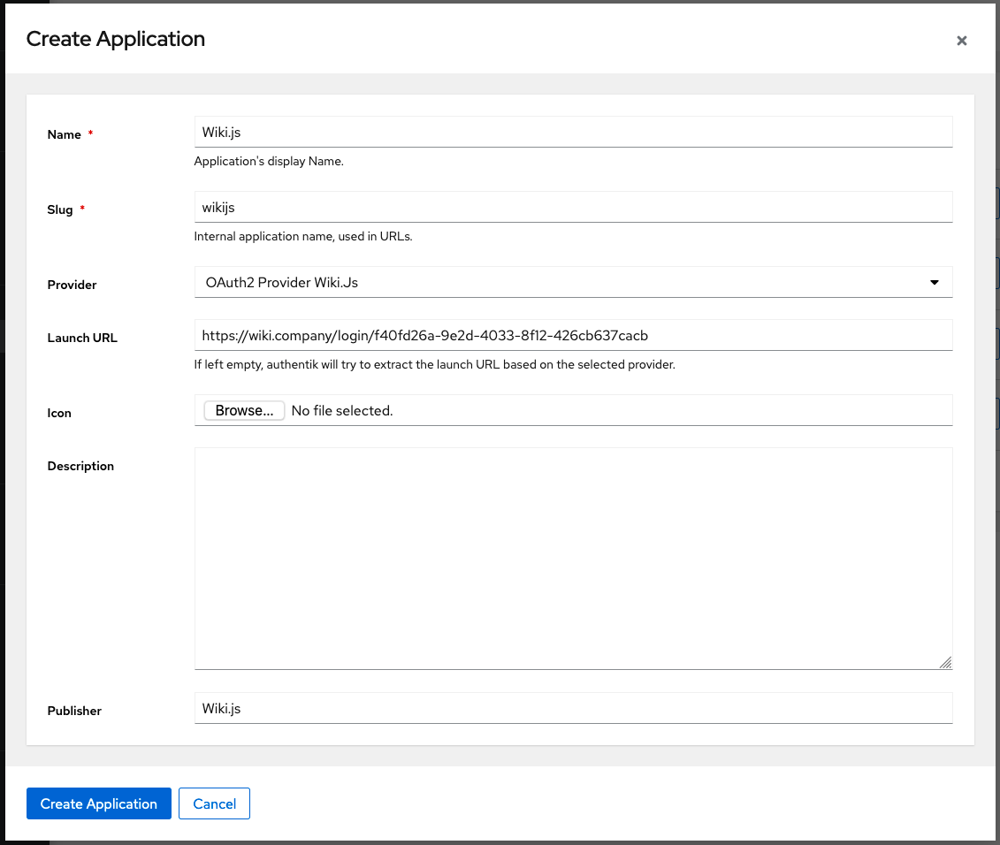

Support level: Community

## What is Wiki.js

> Wiki.js is a wiki engine running on Node.js and written in JavaScript. It is free software released under the Affero GNU General Public License. It is available as a self-hosted solution or using "single-click" install on the DigitalOcean and AWS marketplace.
>
> -- https://en.wikipedia.org/wiki/Wiki.js

:::note
This is based on authentik 2022.11 and Wiki.js 2.5. Instructions may differ between versions.
:::

## Preparation

The following placeholders will be used:

-   `wiki.company` is the FQDN of Wiki.js.
-   `authentik.company` is the FQDN of authentik.

### Step 1

In Wiki.js, navigate to the _Authentication_ section in the _Administration_ interface.

Add a _Generic OpenID Connect / OAuth2_ strategy and note the _Callback URL / Redirect URI_ in the _Configuration Reference_ section at the bottom.

### Step 2

In authentik, under _Providers_, create an _OAuth2/OpenID Provider_ with these settings:

-   Redirect URI: The _Callback URL / Redirect URI_ you noted from the previous step.
-   Signing Key: Select any available key

Note the _client ID_ and _client secret_, then save the provider. If you need to retrieve these values, you can do so by editing the provider.

### Step 3

In Wiki.js, configure the authentication strategy with these settings:

-   Client ID: Client ID from the authentik provider.
-   Client Secret: Client Secret from the authentik provider.
-   Authorization Endpoint URL: https://authentik.company/application/o/authorize/
-   Token Endpoint URL: https://authentik.company/application/o/token/
-   User Info Endpoint URL: https://authentik.company/application/o/userinfo/
-   Issuer: https://authentik.company/application/o/wikijs/
-   Logout URL: https://authentik.company/application/o/wikijs/end-session/
-   Allow self-registration: Enabled
-   Assign to group: The group to which new users logging in from authentik should be assigned.

:::note
You do not have to enable "Allow self-registration" and select a group to which new users should be assigned, but if you don't you will have to manually provision users in Wiki.js and ensure that their emails match the email they have in authentik.
:::

:::note
If you're using self-signed certificates for authentik, you need to set the root certificate of your CA as trusted in WikiJS by setting the NODE_EXTRA_CA_CERTS variable as explained here: https://github.com/Requarks/wiki/discussions/3387.
:::

### Step 5

In authentik, create an application which uses this provider. Optionally apply access restrictions to the application using policy bindings.

Set the Launch URL to the _Callback URL / Redirect URI_ without the `/callback` at the end, as shown below. This will skip Wiki.js' login prompt and log you in directly.

