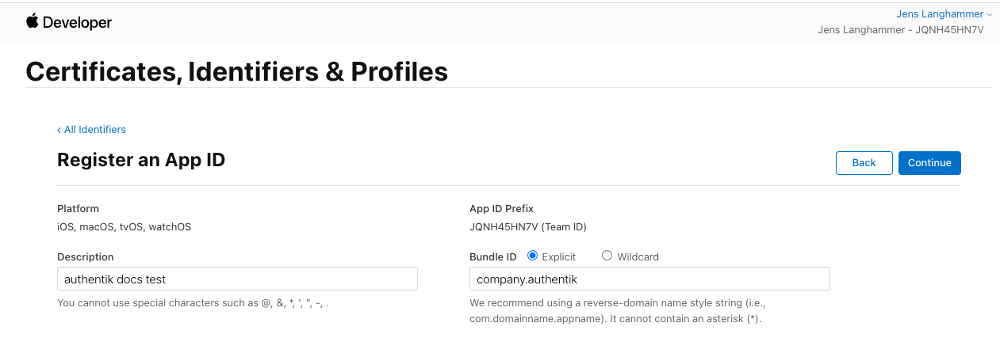
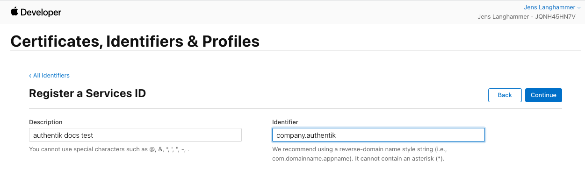
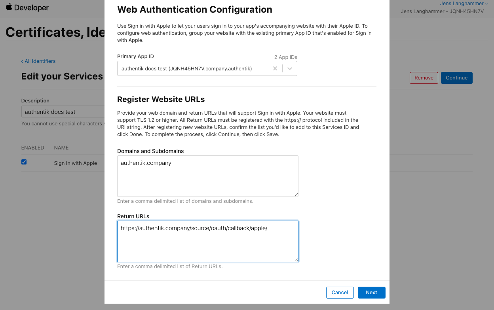
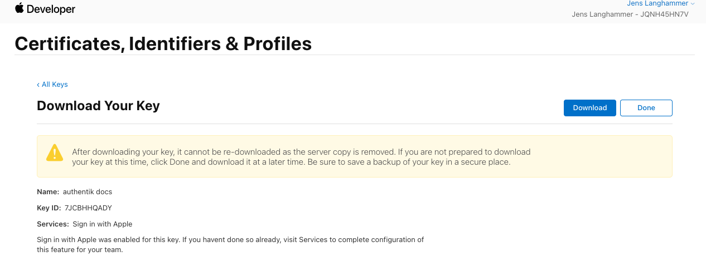

Allows users to authenticate using their Apple ID.

## Preparation

:::warning
An Apple developer account is required for this.
:::

The following placeholders will be used:

-   `authentik.company` is the FQDN of the authentik install.

## Apple

1. Log into your Apple developer account, and navigate to **Certificates, IDs & Profiles**, then click **Identifiers** in the sidebar.
2. Register a new Identifier with the type of **App IDs**, and the subtype **App**.
3. Choose a name that users will recognise for the **Description** field.
4. For your bundle ID, use the reverse domain of authentik, in this case `company.authentik`.
5. Scroll down the list of capabilities, and check the box next to **Sign In with Apple**.
6. At the top, click **Continue** and **Register**.

7. Register another new Identifier with the type of **Services IDs**.
8. Again, choose the same name as above for your **Description** field.
9. Use the same identifier as above, but add a suffix like `signin` or `oauth`, as identifiers are unique.
10. At the top, click **Continue** and **Register**.

11. Once back at the overview list, click on the just-created Identifier.
12. Enable the checkbox next to **Sign In with Apple**, and click **Configure**
13. Under domains, enter `authentik.company`.
14. Under **Return URLs**, enter `https://authentik.company/source/oauth/callback/apple/`.

15. Click on **Keys** in the sidebar. Register a new Key with any name, and select **Sign in with Apple**.
16. Click on **Configure**, and select the App ID you've created above.
17. At the top, click **Save**, **Continue** and **Register**.
18. Download the Key file and note the **Key ID**.

19. Note the Team ID, visible at the top of the page.

## authentik

20. Under _Directory -> Federation & Social login_ Click **Create Apple OAuth Source**

21. **Name**: `Apple`
22. **Slug**: `apple`
23. **Consumer Key:** The identifier from step 9, then `;`, then your Team ID from step 19, then `;`, then the Key ID from step 18.

    Example: `io.goauthentik.dev-local;JQNH45HN7V;XFBNJ82BV6`

24. **Consumer Secret:** Paste the contents of the keyfile you've downloaded

Save, and you now have Apple as a source.

:::note
For more details on how-to have the new source display on the Login Page see [here](../).
:::
