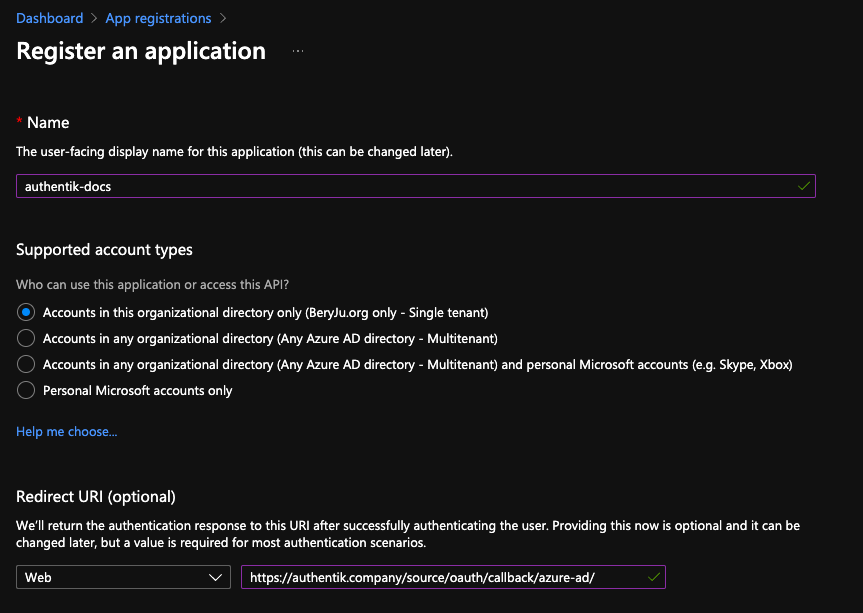
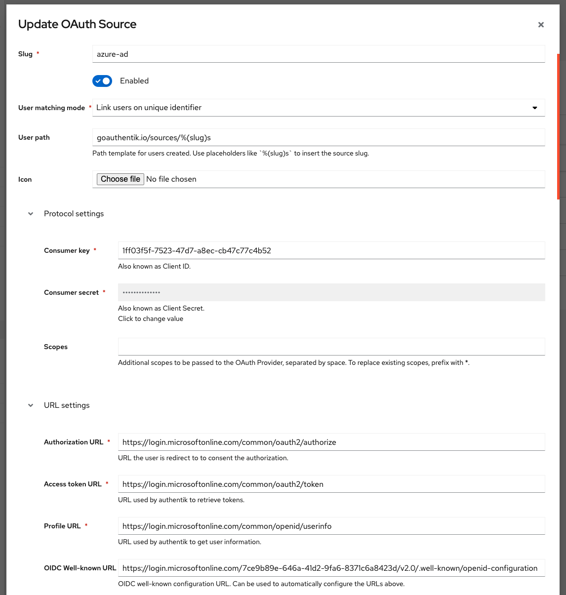

Support level: Community

## Preparation

The following placeholders will be used:

-   `authentik.company` is the FQDN of the authentik install.

## Azure setup

1. Navigate to [portal.azure.com](https://portal.azure.com), and open the _App registration_ service
2. Register a new application

    Under _Supported account types_, select whichever account type applies to your use-case.

    

3. Take note of the _Application (client) ID_ value.

    If you selected _Single tenant_ in the _Supported account types_ prompt, also note the _Directory (tenant) ID_ value.

4. Navigate to _Certificates & secrets_ in the sidebar, and to the _Client secrets_ tab.
5. Add a new secret, with an identifier of your choice, and select any expiration. Currently the secret in authentik has to be rotated manually or via API, so it is recommended to choose at least 12 months.
6. Note the secret's value in the _Value_ column.

## authentik Setup

In authentik, create a new _Azure AD OAuth Source_ in Resources -> Sources.

Use the following settings:

-   Name: `Azure AD`
-   Slug: `azure-ad` (this must match the URL being used above)
-   Consumer key: `*Application (client) ID* value from above`
-   Consumer secret: `*Value* of the secret from above`

If you kept the default _Supported account types_ selection of _Single tenant_, then you must change the URL below as well:

-   OIDC Well-known URL: `https://login.microsoftonline.com/*Directory (tenant) ID* from above/v2.0/.well-known/openid-configuration`

Save, and you now have Azure AD as a source.

:::note
For more details on how-to have the new source display on the Login Page see [here](../general#add-sources-to-default-login-page).
:::
