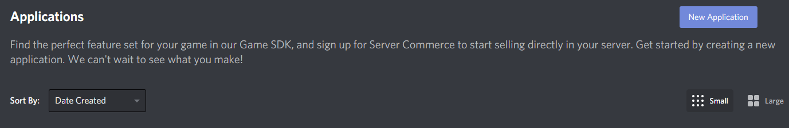
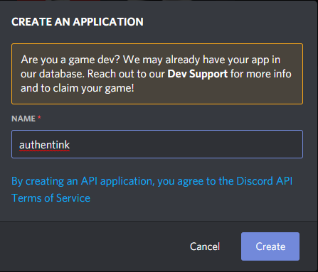
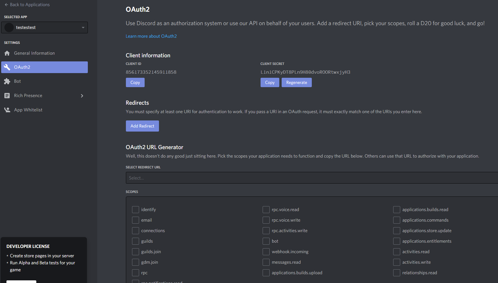
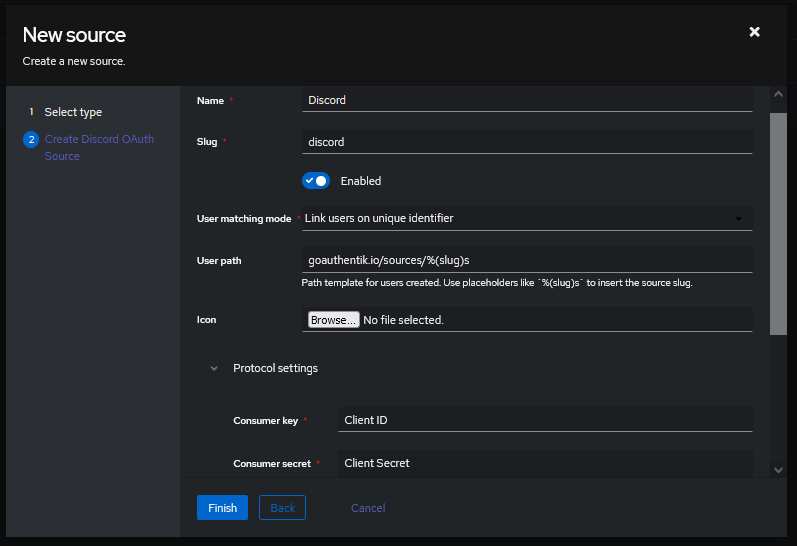

<span class="badge badge--primary">Support level: authentik</span>

Allows users to authenticate using their Discord credentials

## Preparation

The following placeholders will be used:

-   `authentik.company` is the FQDN of the authentik install.

## Discord

1. Create an application in the Discord Developer Portal (This is Free) https://discord.com/developers/applications



2. Name the Application



3. Select **OAuth2** from the left Menu

4. Copy the **Client ID** and _save it for later_

5. **Click to Reveal** the Client Secret and _save it for later_

6. Click **Add Redirect** and add https://authentik.company/source/oauth/callback/discord/

Here is an example of a completed OAuth2 screen for Discord.



## authentik

8. Under _Directory -> Federation & Social login_ Click **Create Discord OAuth Source**

9. **Name:** Choose a name (For the example I used Discord)
10. **Slug:** discord (You can choose a different slug, if you do you will need to update the Discord redirect URLand point it to the correct slug.)
11. **Consumer Key:** Client ID from step 4
12. **Consumer Secret:** Client Secret from step 5

Here is an example of a complete authentik Discord OAuth Source



Save, and you now have Discord as a source.

:::note
For more details on how-to have the new source display on the Login Page see [here](../general#add-sources-to-default-login-page).
:::

### Checking for membership of a Discord Guild

:::info
Ensure that your Discord OAuth source in 'Federation & Social login' has the additional  `guilds` scope added under the 'Protocol settings'.
:::

Create a new 'Expression Policy' with the content below, adjusting the variables where required:

```python
# To get the guild ID number for the parameters, open Discord, go to Settings > Advanced and enable developer mode. 
# Right-click on the server title and select "Copy ID" to get the guild ID.

ACCEPTED_GUILD_ID = "123456789123456789"
GUILD_NAME_STRING = "Whatever you want to call your server in your error message."

# Ensure flow is only run during oauth logins via Discord
if context['source'].provider_type != "discord":
    return True

# Only change below here if you know what you are doing.

# Get the user-source connection object from the context, and get the access token
connection = context['goauthentik.io/sources/connection']
access_token = connection.access_token

guilds = requests.get(
    "https://discord.com/api/users/@me/guilds",
    headers= {
        "Authorization": "Bearer " + access_token,
    }
).json()

user_matched = False
user_matched = any(ACCEPTED_GUILD_ID == g["id"] for g in guilds)
if not user_matched:
    ak_message(f"User is not member of {GUILD_NAME_STRING}.")
return user_matched
```

Now bind this policy to your chosen enrollment and authentication flows for your Discord OAuth source.

### Checking for membership of a Discord Guild role

:::info
Ensure that your Discord OAuth source in 'Federation & Social login' has the additional  `guilds guilds.members.read` scopes added under the 'Protocol settings'.
:::

Create a new 'Expression Policy' with the content below, adjusting the variables where required:

```python
# To get the role and guild ID numbers for the parameters, open Discord, go to Settings > Advanced and enable developer mode. 
# Right-click on the server title and select "Copy ID" to get the guild ID.
# Right-click on the server title and select server settings > roles, right click on the role and click "Copy ID" to get the role ID. 

ACCEPTED_ROLE_ID = "123456789123456789"
ACCEPTED_GUILD_ID = "123456789123456789"
GUILD_NAME_STRING = "Whatever you want to call your server in your error message."
ROLE_NAME_STRING = "Whatever you want to call your role in your error message."

# Only change below here if you know what you are doing.
GUILD_API_URL = "https://discord.com/api/users/@me/guilds/" + ACCEPTED_GUILD_ID + "/member"

# Ensure flow is only run during oauth logins via Discord
if context['source'].provider_type != "discord":
    return True

# Get the user-source connection object from the context, and get the access token
connection = context['goauthentik.io/sources/connection']
access_token = connection.access_token


guild_member_object = requests.get(
    GUILD_API_URL,
    headers= {
        "Authorization": "Bearer " + access_token,
    }
).json()


user_matched = False
user_matched = any(ACCEPTED_ROLE_ID == g for g in guild_member_object["roles"])
if not user_matched:
    ak_message(f"User is not member of the {ROLE_NAME_STRING} role in {GUILD_NAME_STRING}.")
return user_matched
```

Now bind this policy to your chosen enrollment and authentication flows for your Discord OAuth source.
