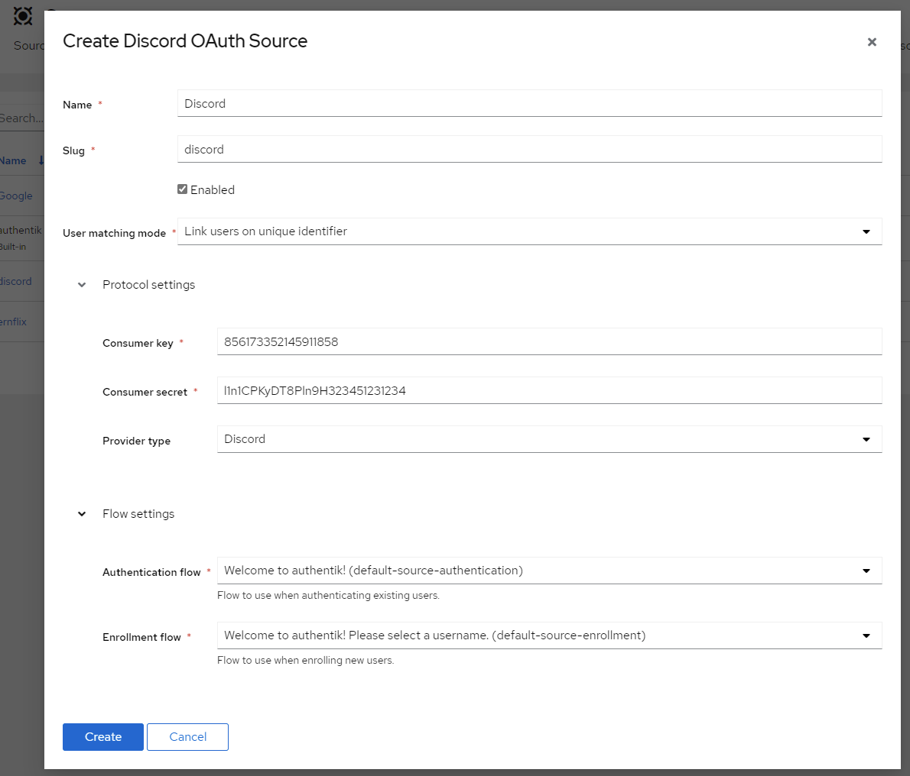

<span class="badge badge--primary">Support level: authentik</span>

Allows users to authenticate using their Discord credentials

## Preparation

The following placeholders will be used:

-   `authentik.company` is the FQDN of the authentik install.

## Discord

1. Create an application in the Discord Developer Portal (This is Free) https://discord.com/developers/applications


2. Name the Application


3. Select **OAuth2** from the left Menu

4. Copy the **Client ID** and _save it for later_

5. **Click to Reveal** the Client Secret and _save it for later_

6. Click **Add Redirect** and add https://authentik.company/source/oauth/callback/discord

Here is an example of a completed OAuth2 screen for Discord.


## authentik

8. Under _Directory -> Federation & Social login_ Click **Create Discord OAuth Source**

9. **Name:** Choose a name (For the example I used Discord)
10. **Slug:** discord (You can choose a different slug, if you do you will need to update the Discord redirect URLand point it to the correct slug.)
11. **Consumer Key:** Client ID from step 4
12. **Consumer Secret:** Client Secret from step 5

Here is an example of a complete authentik Discord OAuth Source



Save, and you now have Discord as a source.

:::note
For more details on how-to have the new source display on the Login Page see [here](../).
:::


### Checking for membership of a Discord Guild

:::info
Requires authentik 2021.12.5.
:::

Refer to Discord API: https://discord.com/developers/docs/resources/user#get-current-user-guilds

To check if the user is member of an organisation, you can use the following policy on your flows:

```python
ACCEPTED_GUILD_ID = "80351110224678912"
ACCEPTED_GUILD_NAME = "1337 Krew"

# Ensure flow is only run during oauth logins via Github
if context['source'].provider_type != "discord":
    return True

# Get the user-source connection object from the context, and get the access token
connection = context['goauthentik.io/sources/connection']
access_token = connection.access_token

# We also access the user info authentik already retrieved, to get the correct username
#discord_username = context["oauth_userinfo"]

# Github does not include Organisations in the userinfo endpoint, so we have to call another URL

guilds = requests.get(
    "https://discord.com/api/users/@me/guilds",
    headers= {
        "Authorization": "Bearer " + access_token,
    }
).json()

# `guilds` will be formatted like this
# [
#     {
#       "id": "80351110224678912",
#       "name": "1337 Krew",
#       "icon": "8342729096ea3675442027381ff50dfe",
#       ...
#     }
# ]
user_matched = False
user_matched = any(ACCEPTED_GUILD_ID == g["id"] for g in guilds)
if not user_matched:
    ak_message(f"User is not member of {ACCEPTED_GUILD_NAME}.")
return user_matched
```

If a user is not member of the chosen organisation, they will see this message

TODO: Add picture
