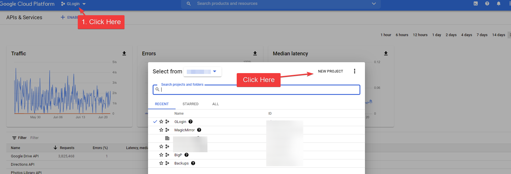
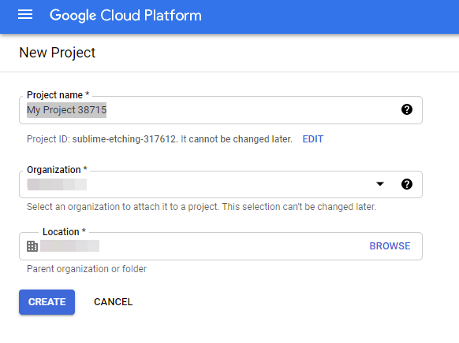
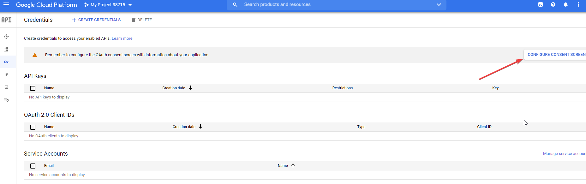
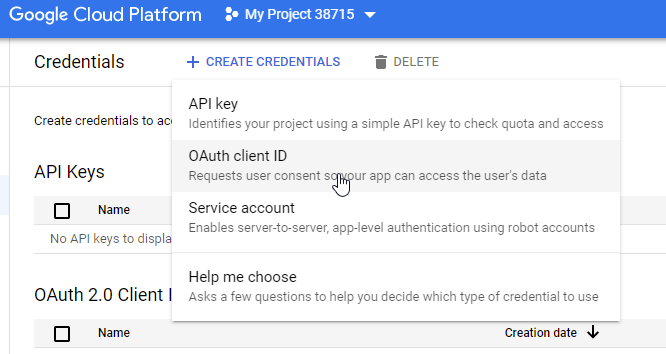
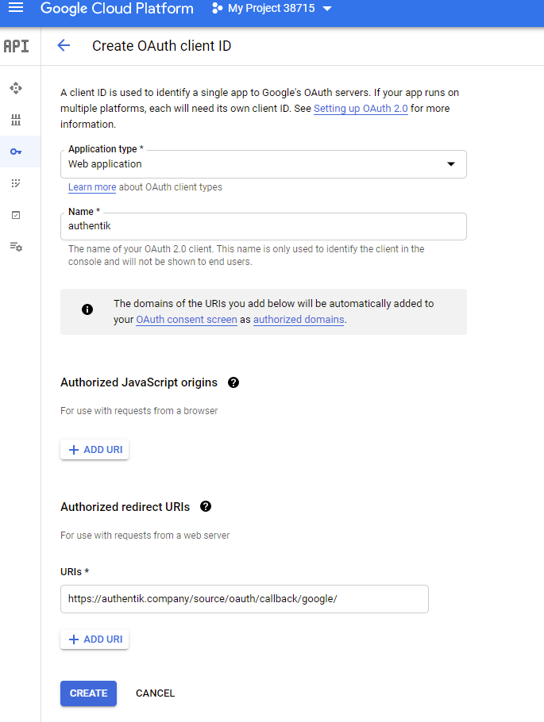
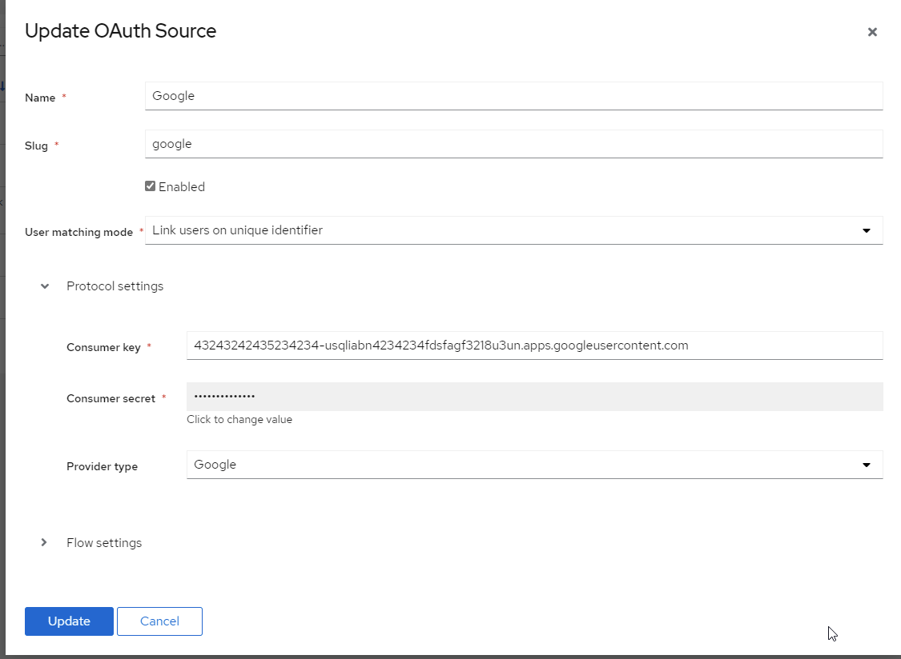

Allows users to authenticate using their Google credentials

## Preparation

The following placeholders will be used:

-   `authentik.company` is the FQDN of the authentik install.

## Google

You will need to create a new project, and OAuth credentials in the Google Developer console. The developer console can be overwhelming at first.

1. Visit https://console.developers.google.com/ to create a new project
2. Create a New project.

3. **Project Name**: Choose a name
4. **Organization**: Leave as default if unsure
5. **Location**: Leave as default if unsure

6. Click **Create**
7. Choose your project from the drop down at the top
8. Click the **Credentials** menu item on the left. It looks like a key.

9. Click on **Configure Consent Screen**

10. **User Type:** If you do not have a Google Workspace (GSuite) account choose _External_. If you do have a Google Workspace (Gsuite) account and want to limit access to only users inside of your organization choose _Internal_

_I'm only going to list the mandatory/important fields to complete._

11. **App Name:** Choose an Application
12. **User Support Email:** Must have a value
13. **Authorized Domains:** authentik.company
14. **Developer Contact Info:** Must have a value
15. Click **Save and Continue**
16. If you have special scopes configured for google, enter them on this screen. If not click **Save and Continue**
17. If you want to create Test Users enter them here, if not click **Save and Continue**
18. From the _Summary Page_ click on the \*_Credentials_ link on the left. Same link as step 8
19. Click **Create Credentials** on the top of the screen
20. Choose **OAuth Client ID**

21. **Application Type:** Web Application
22. **Name:** Choose a name
23. **Authorized redirect URIs:** `https://authenik.company/source/oauth/callback/google/`

24. Click **Create**
25. Copy and store _Your Client ID_ and _Your Client Secret_ for later

## authentik

26. Under _Directory -> Federation & Social login_ Click **Create Google OAuth Source**

27. **Name**: Choose a name (For the example I use Google)
28. **Slug**: google (If you choose a different slug the URLs will need to be updated to reflect the change)
29. **Consumer Key:** Your Client ID from step 25
30. **Consumer Secret:** Your Client Secret from step 25

Here is an example of a complete authentik Google OAuth Source

Save, and you now have Google as a source.

:::note
For more details on how-to have the new source display on the Login Page see [here](../).
:::
