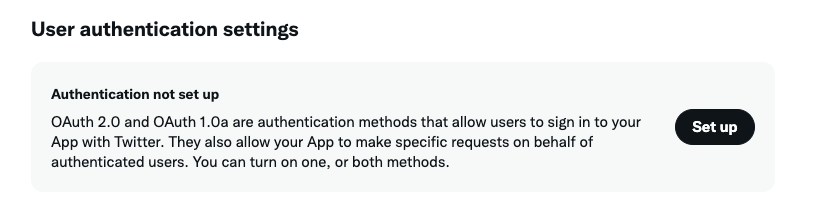
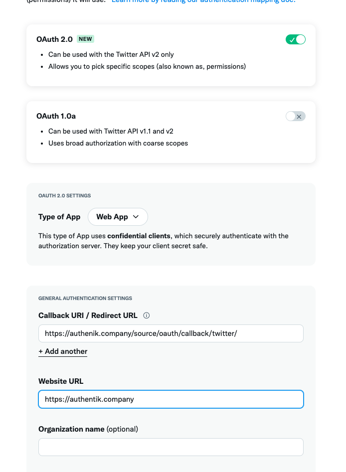

Allows users to authenticate using their twitter credentials

## Preparation

The following placeholders will be used:

-   `authentik.company` is the FQDN of the authentik install.

## Twitter

You will need to create a new project, and OAuth credentials in the Twitter Developer console.

1. Visit https://developer.twitter.com/ to create a new App
2. Select an environment fitting to your use-case
3. Give the app a name, for example _authentik_
4. Finish setting up the app by clicking **App settings**. Any of the API keys on this screen are not used by authentik.
5. Click the **Set up** button

6. Enable **OAuth 2.0**
7. Set **Type of App** to _Web_
8. Set **Callback URI / Redirect URL** to `https://authenik.company/source/oauth/callback/twitter/`
9. Set **Website URL** to `https://authentik.company`

10. Confirm with **Save**
11. Copy and store **Client ID** and **Client Secret** for later

## authentik

1. Under _Directory -> Federation & Social login_ Click **Create Twitter OAuth Source**

2. **Name**: Choose a name (For the example I use Google)
3. **Slug**: twitter (If you choose a different slug the URLs will need to be updated to reflect the change)
4. **Consumer Key:** Your Client ID from step 25
5. **Consumer Secret:** Your Client Secret from step 25

:::note
For more details on how-to have the new source display on the Login Page see [here](../).
:::
